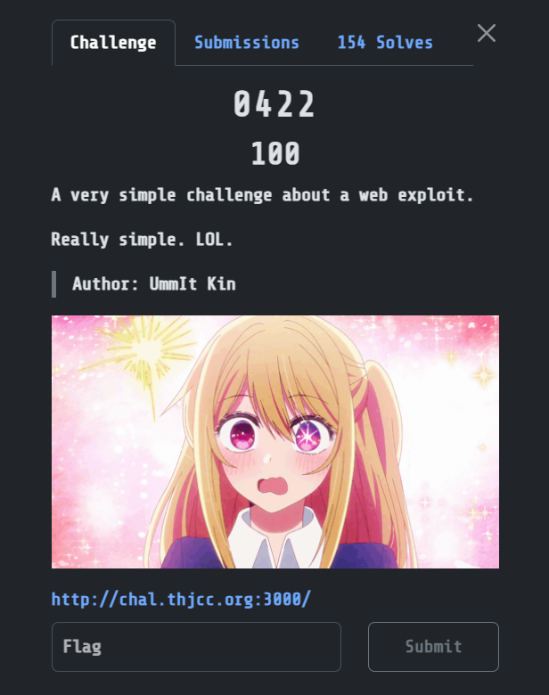
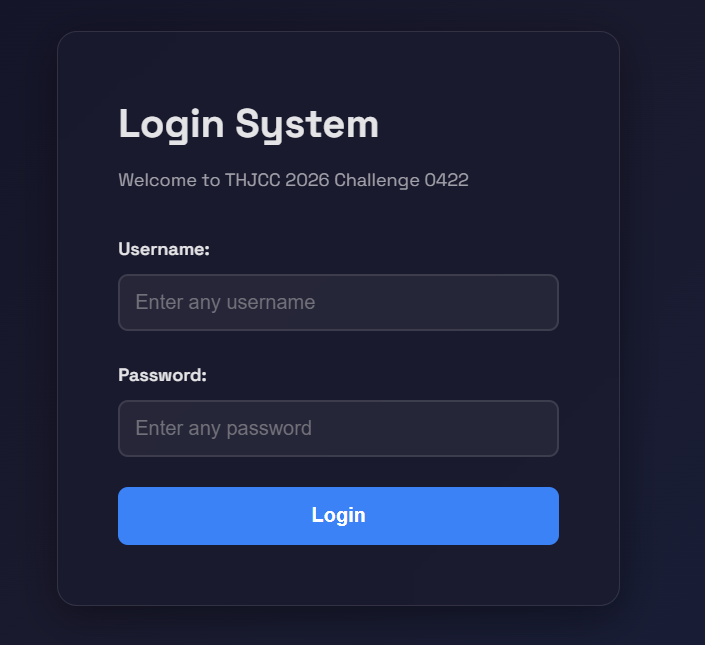
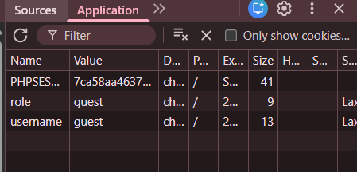
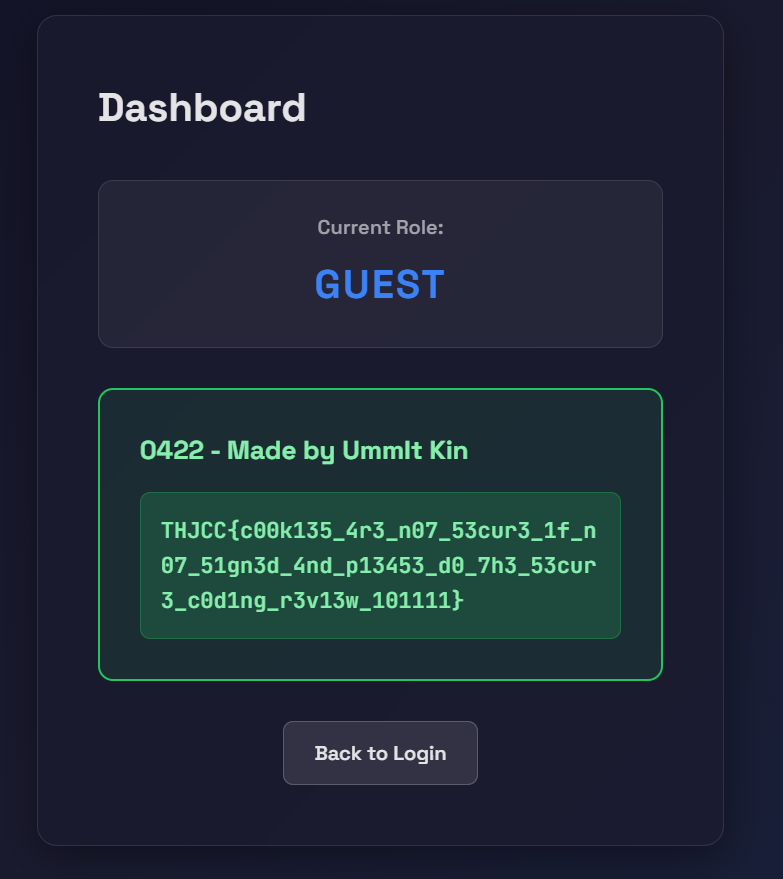

## 0422  

We are given a simple login page.  

Submitting any credentials will give us an error, but if we can find that the website stores a `role` cookie on login.  

Changing the `role` cookie value to `admin` will give us the flag.  

Flag: `THJCC{c00k135_4r3_n07_53cur3_1f_n07_51gn3d_4nd_p13453_d0_7h3_53cur3_c0d1ng_r3v13w_101111}`