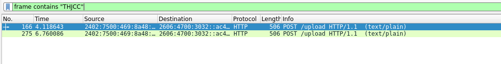
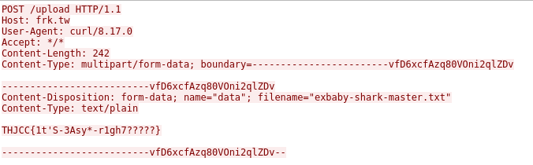

## ExBaby Shark Master  

We are given a packet capture to analyse.  

We can filter for the flag prefix in Wireshark using  `frame contains "THJCC"`, which will actually narrow it down to two packets.  

Following the TCP stream will then reveal the flag.  

Flag: `THJCC{1t'S-3Asy*-r1gh7?????}`