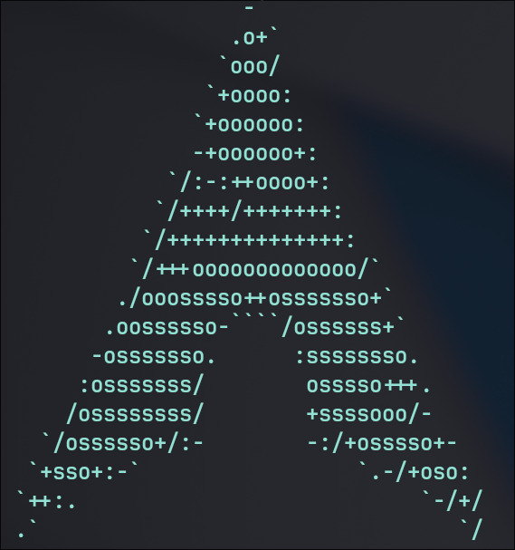
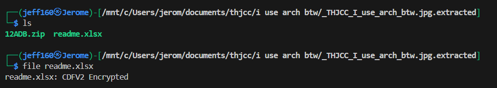
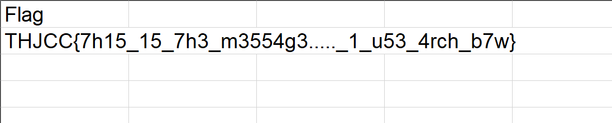

## I use arch btw  


We are given an image file to analyse.  



Running `binwalk` on the image will reveal a zip archive inside, which we can extract.  

We will find a password-protected Excel file.  



We can use `office2john` to extract the password hash, then use John the ripper and `rockyou.txt` to crack the hash, giving us `rush2112` as the password.  

```bash
office2john readme.xlsx > hash.txt

john --wordlist=rockyou.txt hash.txt
john --show hash.txt
```

We can then use the password to unlock `readme.xlsx`, giving us the flag.  



Flag: `THJCC{7h15_15_7h3_m3554g3....._1_u53_4rch_b7w}`