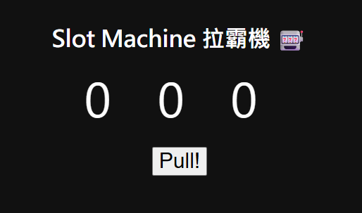
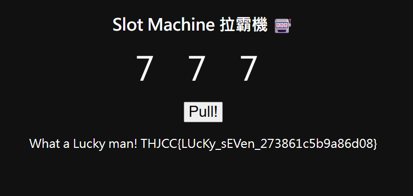

## Las Vegas  


We are given a webpage that requires us to roll `777` to get the flag.  



Looking at the HTML source, we realise that the slot machine logic is entirely client-side, and that the website makes a `POST` request with parameter `n` to validate the number.  

```js
const slot = document.getElementById("slot");
const btn = document.getElementById("spin");
const message = document.getElementById("message");

let interval;
function getRandomDigit() {
    return Math.floor(Math.random() * 10);
}

btn.onclick = function() {
    btn.disabled = true;
    let digits = [0,0,0];
    let count = 0;

    interval = setInterval(() => {
        for (let i = 0; i < 3; i++) {
            digits[i] = getRandomDigit();
        }
        slot.textContent = digits.join(' ');
        count++;
        if(count > 20){ 
            clearInterval(interval);
            const n = digits.join('');
            fetch("/?n=" + n, {method: "POST"})
                .then(resp => resp.text())
                .then(txt => {
                    message.innerHTML = txt;
                    btn.disabled = false;
                });
        }
    }, 100);
};
```

To get the flag, we can either override with `Math.random = _=> 0.7` in the browser console, or `POST` with `n` as `777`.  



Flag: `THJCC{LUcKy_sEVen_273861c5b9a86d08}`