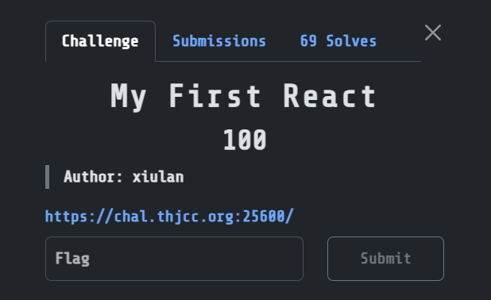
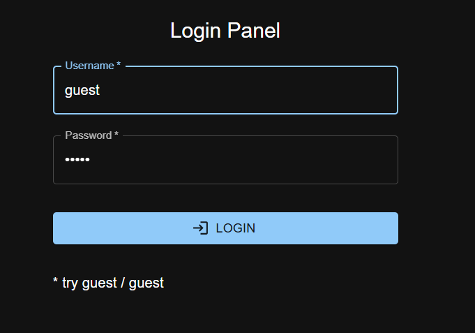
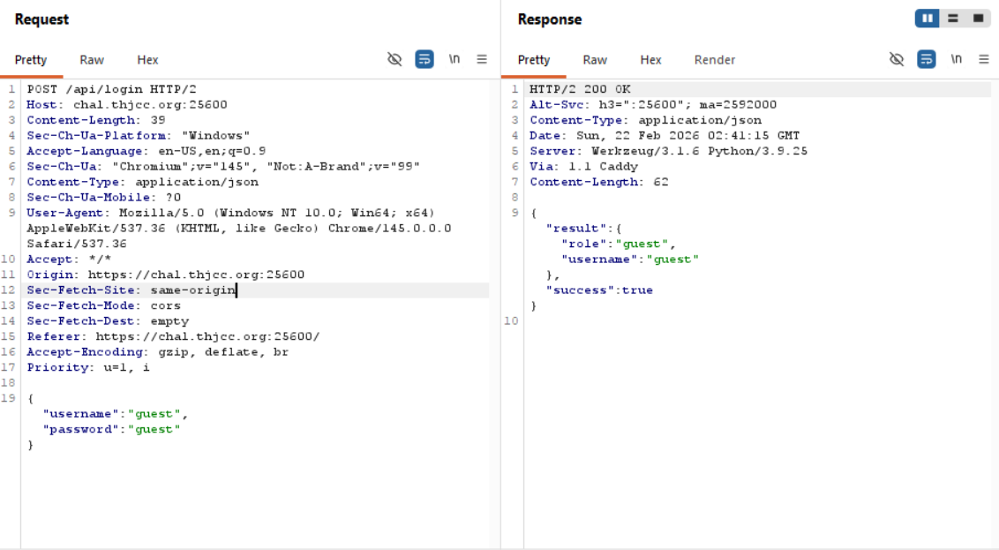

client side code exposed the auth logic lol
flag endpoint is dynamically constructed

## My First React  



We are given a pretty minimal React website where we can login as `guest`.  



If we intercept the login request in BurpSuite, we realise that the website doesn't set any cookies or redirect to any other endpoints, which hints that the authentication is entirely client-side.  



Inside the HTML source of the website, we can find a JavaScript source file.  

```html
<!doctype html>
<html lang="en">
  <head>
    <meta charset="UTF-8" />
    <link rel="icon" type="image/svg+xml" href="/vite.svg" />
    <meta name="viewport" content="width=device-width, initial-scale=1.0" />
    <title>Vite + React + TS</title>
    <script type="module" crossorigin src="/assets/index-rraHEEuN.js"></script>
    <link rel="stylesheet" crossorigin href="/assets/index-DNY86fq8.css">
  </head>
  <body>
    <div id="root"></div>
  </body>
</html>
```

We can find this code section inside the source file.  

```js
E.useEffect(()=>{(async()=>{const t=jd;if(l(!0),e===t(456))try{let e=Math[t(446)](Date.now()/1e4);const n=await async function(e){const t=jd,n=(new TextEncoder)[t(434)](e),r=await crypto[t(457)][t(467)](t(461),n);return Array.from(new Uint8Array(r))[t(454)](e=>e.toString(16)[t(443)](2,"0"))[t(431)]("")}(""+e),r=await fetch(n);if(!r.ok)throw new Error(t(430)+r[t(458)]);const a=(await r[t(440)]())[t(427)];o(a)}catch(n){o(t(447))}else o("Wasn't it a nice day?");l(!1)})()},[e])
```

This roughly deobfuscates to the code below. Essentially, the webpage constructs a dynamic flag endpoint using the SHA-256 hash of the current timestamp.  

```js
import { useState, useEffect } from "react";

function AuthComponent({ role, onLogout }) {
  const [message, setMessage] = useState("");
  const [loading, setLoading] = useState(true);

  useEffect(() => {
    (async () => {
      setLoading(true);

      if (role === "authorizedRole") {
        try {
          const timestamp = Math.floor(Date.now() / 10000);

          const encoder = new TextEncoder();
          const data = encoder.encode("" + timestamp);
          const hashBuffer = await crypto.subtle.digest("SHA-256", data);
          const hashArray = Array.from(new Uint8Array(hashBuffer));
          const hashHex = hashArray.map(b => b.toString(16).padStart(2, "0")).join("");

          const url = `https://chal.thjcc.org:25600/${hashHex}`;

          const response = await fetch(url);
          if (!response.ok) throw new Error("Network response was not ok: " + response.status);

          const result = await response.json();
          setMessage(result.message);
        } catch (error) {
          setMessage("Authentication failed");
        }
      } else {
        setMessage("Wasn't it a nice day?");
      }

      setLoading(false);
    })();
  }, [role]);

  return { message, loading };
}
```

We can reproduce the endpoint generation logic in Python, and requesting it will give us the flag.  

```python
url = "https://chal.thjcc.org:25600"

bucket = int(time.time() * 1000 // 10000)
hash = hashlib.sha1(str(bucket).encode()).hexdigest()

endpoint = f"{url}/{hash}"
```

Flag: `THJCC{CSR_c4n_b3_d4ng3rrr0us!}`