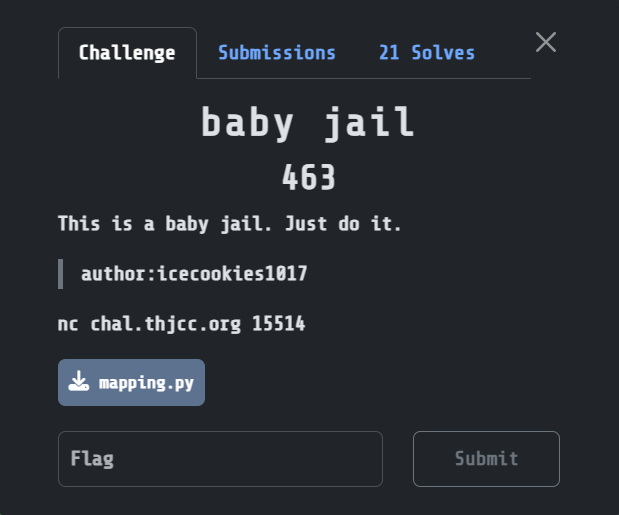

## baby jail  



The dist for this pyjail just gives us this custom mapping function that only maps lowercase alphabets.  

From this, we can assume that the server encrypts our payload before execution.  

```python
def mapping(k):
    mapping = {}
    for i in range(26):
        plain = chr(ord('a') + i)
        mapped_index = (i ^ k) % 26
        mapped = chr(ord('a') + mapped_index)
        mapping[plain] = mapped
    return mapping
```

Connecting to the jail, we can test a few inputs to observe its behaviour. The server tells us the whitelist for the jail, and we can also infer that the jail encrypts our input before running it through `eval()`, and will print the output if successful, otherwise, it will just return the ciphertext.  

There is also a `flag` variable in the jail.  

We can write a script that will retrieve and construct the full mapping from the jail, then leak the `flag` variable index by index.  

```python
from pwn import *
import string

io = remote("chal.thjcc.org", 15514)

# build cipher mapping
def build_cipher_map(ciphertext):
    return {p: c for p, c in zip(string.ascii_lowercase, ciphertext)}

io.sendlineafter(b'>', string.ascii_lowercase.encode())

cipher = io.recvline().decode().strip()

cipher_map = build_cipher_map(cipher)

def encrypt(text):
    return "".join(cipher_map.get(c, c) for c in text)

# actual jail
flag = ''
idx = 0

while not flag.endswith('}'):
    print(flag)

    io.sendlineafter(b'>', encrypt(f'flag[{idx}]').encode())

    resp  = io.recvline().decode().strip()
    
    if len(resp) == 1:
        flag += resp
        idx += 1

print("Flag:", flag)
```

Flag: `THJCC{7h3_b4by_j411_15_v3ry_345y_r19h7?`