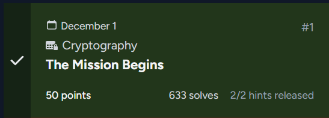
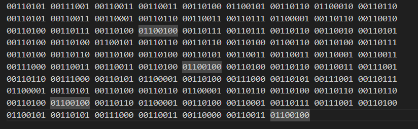

## The Mission Begins  



### Challenge Description
```
You step into the North Pole Security Operations Room for your first official briefing. Before you can even say a word, an elf swivels around in his chair and looks directly at you with a grin that is just a little too confident.

“Oh look, the new human recruit finally arrived,” he says loudly enough for the entire room to hear. “Everyone, make sure we hide anything that requires actual brainpower.”

A few elves laugh under their breath. Another one leans back in his chair, folds his arms, and raises an eyebrow at you.

“No offense,” he says, “but you probably do not even know the most basic fundamentals. If the Krampus Syndicate left something simple lying around, you would be completely lost.”

The room chuckles again, and someone hands you a datapad as if they are testing a child.

“Here,” the first elf says. “A warm up. Nothing serious. Just enough to see whether you actually belong here or whether Santa needs to reconsider his hiring standards.”

The elves nearby turn in their chairs to watch. A few whisper to each other, clearly expecting you to embarrass yourself.

Your mission has not even begun, and already the room is challenging you. Now it is your turn to prove them wrong.
```

### Writeup  

We are provided with the encrypted flag in the form of a binary string.  



Running the ciphertext through CyberChef leads to a series of decryptions before we get the flag.  


Flag: `csd{W3lc0m3_8aCK_70_adv3N7_2025}`