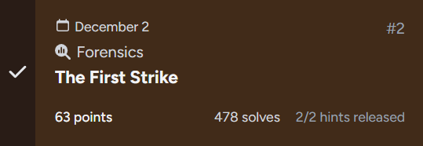
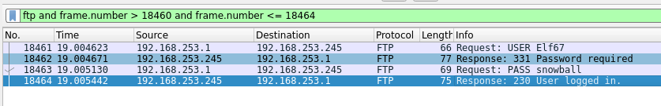

## The First Strike



## Challenge Description

```
A series of repeated authentication failures was detected against the FTP service. The traffic pattern matched known Krampus Syndicate infrastructure, indicating the beginning of their intrusion attempts. After a sustained burst of password guessing, one request finally succeeded.

Your task is to examine the logs or packet capture, identify which account was compromised, and determine the password used during the successful login.

Submit your answer as: csd{username_password}
```

### Writeup  

We are given a `.pcap` file which we are supposed to analyse and find the correct login credentials.  

Immediately after opening the file in Wireshark, we can see some login attempts.  


A successful login message would probably contain `"logged in"` or something similar, so we can filter the packets as such.  

```
ftp and (ftp.response.arg contains "logged")
```

After running that filter, we filtered 1 packet that corresponds to the successful login. Now we just need to get the preceeding packets to view the credentials.  


We can use another filter to get the packets within a small range before the login message.  

```
ftp and frame.number > 18460 and frame.number <= 18464
```



Flag: `csd{Elf67_snowball}`