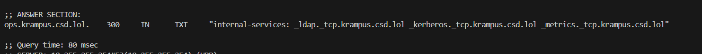
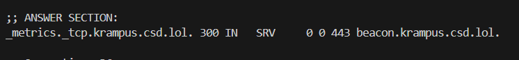
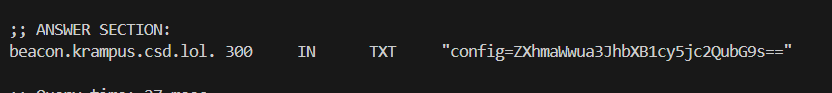
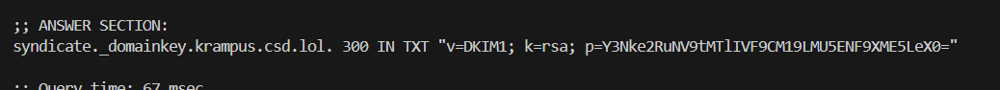

## Syndicate Infrastructure


### Challenge Description  
```
Our monitoring systems have flagged suspicious DNS activity originating from a domain registered by the KRAMPUS SYNDICATE. Initial analysis suggests they're using it to coordinate operations against crucial North Pole systems.

The domain in question: krampus.csd.lol

We need you to perform a full DNS reconnaissance sweep. The Syndicate thinks they're clever, hiding their infrastructure in plain sight but they're wrong.

Map their infrastructure. Find what they're hiding. Report back before they realize we're onto them.

- NPLD Threat Intelligence Division

Note: All the information you need is in the DNS records. Dig deep.
```

## Writeup  

We are provided with a domain which we are supposed to do DNS recon on and hopefully find the flag.  

THe challenge note hints at us having to use the `dig` command to explore the domain.  

We can try guessing and digging standard subdomains. Fetching TXT records from the `_dmarc` subdomain reveals an email `forensics@ops.krampus.csd.lol`.  


The TXT records of the `ops.krampus.csd.lol` subdomain then reveals some internal services along with their subdomains.  



We can fetch the SRV records from all the internal service subdomains, and only `_metrics._tcp.krampus.csd.lol` uncovers another subdomain.  



`beacon.krampus.csd.lol` TXT records contains a suspicious Base64 string, which decodes to `exfil.krampus.csd.lol`.  



The `exfil` subdomain TXT records contains the DKIM selector `syndicate`.  


Fetching the DKIM records using the selector gives us a public key, which contains the Base64 encoded flag.  



Flag: `csd{dn5_m19HT_B3_K1ND4_W0NKy}`