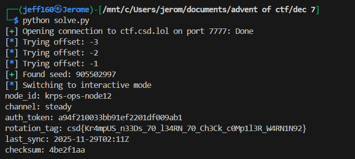

## Failed Exfil


### Challenge Description

```
The KRAMPUS Syndicate has been using a small remote endpoint they quietly dropped on compromised NPLD machines. When they gain access to a system, they connect to this endpoint and forward whatever “precious data” they’ve collected back to their infrastructure.

During forensics analysis of the machines, analysts discovered the endpoint and later found a screenshot from a dark web forum where a Syndicate member bragged about their exfiltration method which for some reason included a copy of the server binary itself.

You’ve been given the screenshot and access to the live endpoint. See if you can identify a flaw in their server and extract the data they assumed was hidden.

Live endpoint: nc ctf.csd.lol 7777
```

### Writeup  

Two pwn challs in a row, CyberStudents must really hate their audience.  

We are again provided with a remote endpoint to interact with, but this time, we aren't provided with the binary.  

Instead, we are given a screenshot of a Telegram conversation. One of the messages contains a URL, which when visited, downloads a binary called `collector`.  


Diassembling the binary in Ghidra, we find a few key functions.  

The `main()` function reveals that this is a simple CLI program with a few commands. It also contains a reference to `init()` and `handle_admin()`.   

```c
undefined8 main(EVP_PKEY_CTX *param_1)
{
  uint uVar1;
  time_t tVar2;
  char *pcVar3;
  char local_38 [44];
  undefined4 local_c;
  
  init(param_1);
  tVar2 = time((time_t *)0x0);
  srand((uint)tVar2);
  local_c = FUN_004011c0();
LAB_00401531:
  printf("cmd: ");
  pcVar3 = fgets(local_38,0x20,stdin);
  if ((pcVar3 == (char *)0x0) || (uVar1 = parse_command(local_38), uVar1 == 4)) {
    return 0;
  }
  if (uVar1 < 5) {
    if (uVar1 == 3) {
      handle_admin(local_c);
      goto LAB_00401531;
    }
    if (uVar1 < 4) {
      if (uVar1 == 1) {
        handle_write();
      }
      else {
        if (uVar1 != 2) goto LAB_004015af;
        handle_read();
      }
      goto LAB_00401531;
    }
  }
LAB_004015af:
  puts("?");
  goto LAB_00401531;
}
```

Besides handling command inputs, `main()` also generates and stores a random number in the variable `local_c` using `FUN_004011c0()` on startup.  

```c
void FUN_004011c0(void)
{
  rand();
  return;
}
```

`init()` reads a file called `metadata.bin` and returns its contents, which most likely contains our flag.  

```c
int init(EVP_PKEY_CTX *ctx)
{
  int iVar1;
  FILE *__stream;
  
  setbuf(stdout,(char *)0x0);
  __stream = fopen("metadata.bin","rb");
  if (__stream == (FILE *)0x0) {
    puts("If you see this on remote, contact admin");
    exit(1);
  }
  fread(metadata,1,0x100,__stream);
  iVar1 = fclose(__stream);
  return iVar1;
}
```

The main function we are concerned with is `handle_admin()`. It prompts us for an integer, which it compares against `local_c` (the random number from earlier). If they match, the function will then output the contents of `metadata.bin`.  

```c
void handle_admin(int param_1)
{
  char *pcVar1;
  ulong uVar2;
  char local_118 [268];
  int local_c;
  
  printf("auth: ");
  pcVar1 = fgets(local_118,0x100,stdin);
  if (pcVar1 != (char *)0x0) {
    uVar2 = strtoul(local_118,(char **)0x0,10);
    local_c = (int)uVar2;
    if (local_c == param_1) {
      puts(metadata);
    }
    else {
      puts("denied");
    }
  }
  return;
}
```

To get the flag, we need to get the exact seed used for the RNG to reproduce the number generated.  

The main vulnerability in the program lies in the way it seeds its RNG. In the `srand()` call, `time(0)` is used, which returns the current timestamp in seconds, making the seed predictable.  

```c
tVar2 = time((time_t *)0x0);
srand((uint)tVar2);
```

We can write a script to bruteforce the seed. Immediately upon connecting to the server, we will get the current time in seconds to seed our RNG.  

To account for the tiny delay between the server starting and us establishing a connection, we can bruteforce a small range of time offsets, before simulating the RNG and submitting the result.  

```python
connect_time = int(time.time())

libc = ctypes.CDLL("libc.so.6")

for i in range(-3, 3):  # max 3 sec offset
    log.info(f'Trying offset: {i}')

    libc.srand(connect_time + i)
    rand = libc.rand()
    
    r.sendlineafter(b"cmd: ", b"admin")
    r.sendlineafter(b"auth: ", str(rand).encode())

    res = r.recvline().decode()
        
    if 'denied' not in res:
        log.success(f"Found seed: {rand}")

        r.interactive()
```

One of the time offsets will work, authenticating us as admin and getting the server to output the contents of `metadata.bin`, along with the flag.  



Flag: `csd{Kr4mpUS_n33Ds_70_l34RN_70_Ch3Ck_c0Mp1l3R_W4RN1N92}`