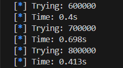
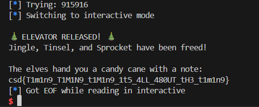

## Time to Escalate


### Challenge Description

```
Three elves from the Wrapping Division (Jingle, Tinsel, and Sprocket) are trapped in Elevator Shaft 3B after a KRAMPUS SYNDICATE intrusion locked down the control panel.

Our forensics team recovered partial intel: the Syndicate replaced the elevator's authentication module with a hastily written PIN validator. The elevator panel accepts a 6 digit PIN, and each incorrect attempt triggers a 3 second lockout, so brute force isn't viable.

Here's the strange part: even when maintenance tested the correct PIN, the system took an unusually long time to process it. Our hardware team suspects the validator is doing something weird under the hood, but we haven't had time to investigate further.

Time is running out. The elves have limited candy cane rations. Hurry up!

Connect at: nc ctf.csd.lol 5040
```

### Writeup  

We are given a remote service to interact with. The service expects a 6-digit PIN, and we are given `100` attempts to guess it.  


We aren't allowed to input any characters besides digits, so this isn't a command injection challenge or a Pyjail.  


When we enter a random PIN, the server actually outputs the time it took to process it.  


Hence our best guess is that this is a timing attack challenge, and the server adds a delay for each character it verifies. The server most likely exits early when it detects the first incorrect character in the PIN.  

We can test this theory by bruteforcing the first character of the PIN, which shows that only one of the digits had a noticeably longeer delay than the rest.  



We can thus write a script to bruteforce the PIN by getting the character with the longest delay at each successive position, which will cause the service to output a message containing the flag.  



Flag: `csd{T1m1n9_T1M1N9_t1M1n9_1t5_4LL_480UT_tH3_t1m1n9}`