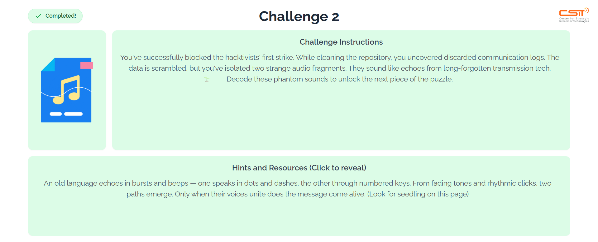
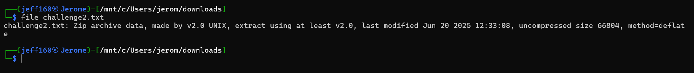
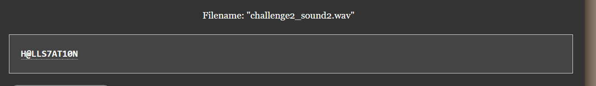
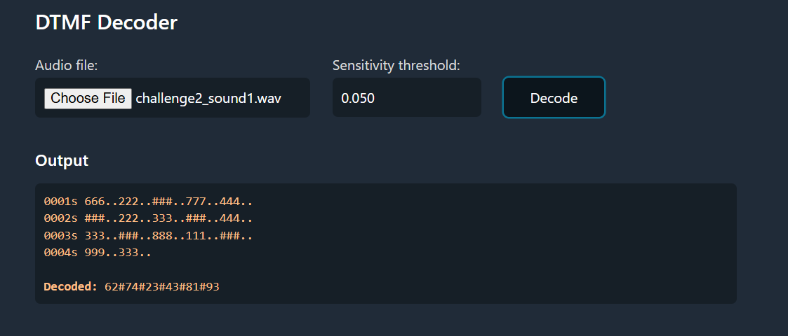
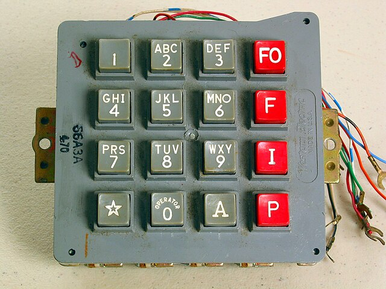

We are given a `.txt` file. Opening it in Notepad reveals a bunch of gibberish, so the next step would be to check the file type.  

After renaming it with the `.zip` extension, we can then extract the zip archive, revealing two files.  
  
The second audio file appears to be Morse code, so we can simply run it through an [online decoder](https://morsecode.world/international/decoder/audio-decoder-adaptive.html).

The first audio file on the other hand, appears to be [DTMF](https://en.wikipedia.org/wiki/DTMF_signaling). It's basically the sounds on those old ahh telephones.  

Running it through an [online decoder](https://dtmf.netlify.app/) produces the following.  

At first glance, the above sequence appears to be gibberish, however, we can map the numbers to the DTMF keypad. We split the cipher by the `#`, then map the digits based on the key presses (2nd digit is the number of times the 1st digit is pressed).  

  
Putting everything together, we get the flag: `CSIT{NSCITYH@LLS7AT10N}`