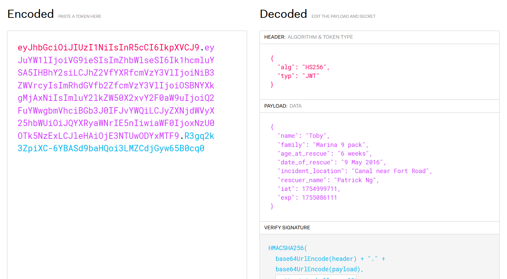

Upon accessing the webpage, it seems that we have to submit a valid JWT token to retrieve the flag.  

The console messages gave us a hint on how to construct the token and even gave the secret key. How nice.

We are given a sample JWT token. Since the current JWT.io UI is trash, we can use the [Wayback Machine snapshot](https://web.archive.org/web/20250115225215/https://jwt.io/) instead.

On decoding, it appears that we have to fill in the fields with the correct arguments to get the correct payload.  

Going back to the webpage, we see that there are multiple cookies, with some corresponding to the JSON payload fields. 

We can simply URL decode the cookie data and add them into our payload, then use the provided secret key to encode the payload, giving us the valid JWT token.  

Submitting the token in the webage then gives us the flag.  

