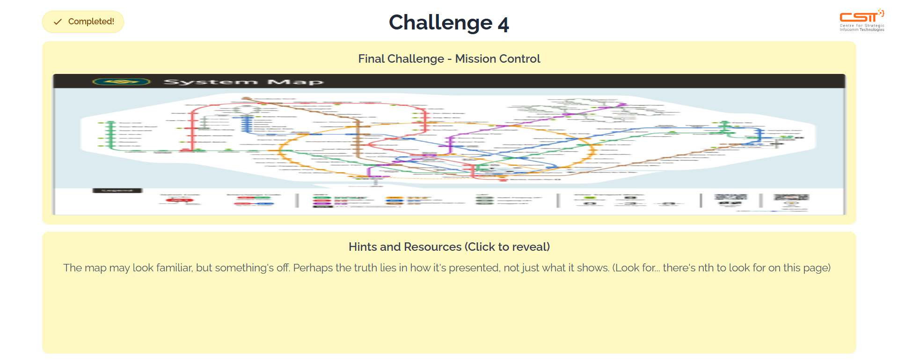
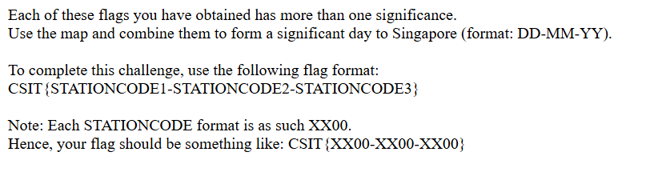

We are given a large image of an MRT map. Downloading and opening it reveals a QR code at the bottom right corner.  

Upon scanning, we are redirected to a webpage with the instructions for this challenge.  

Looking back at the flags from the previous challenges, they are indeed all MRT stations in Singapore. We can simply get their corresponding station codes, which form the date of Singapore's National Day. 

Flag: `CSIT{NS09-EW08-NS25}`