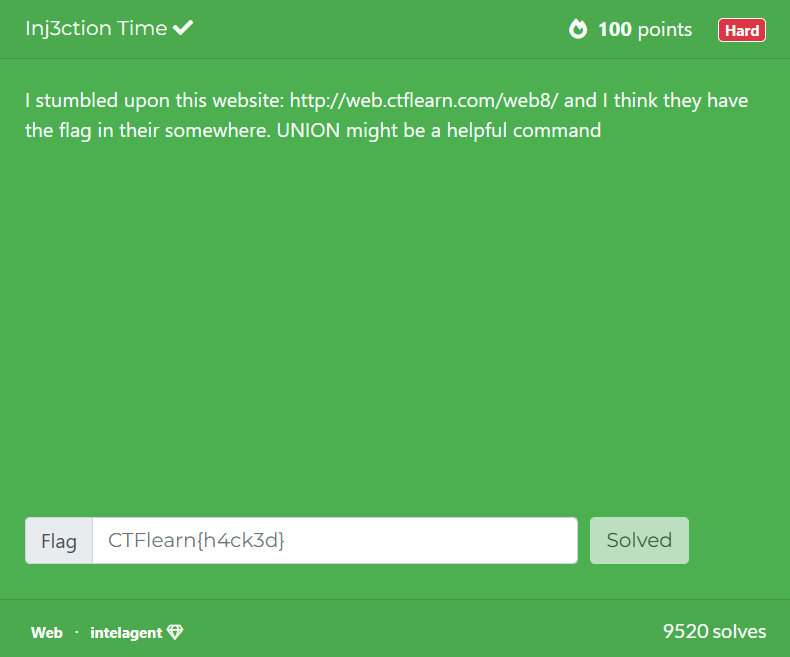
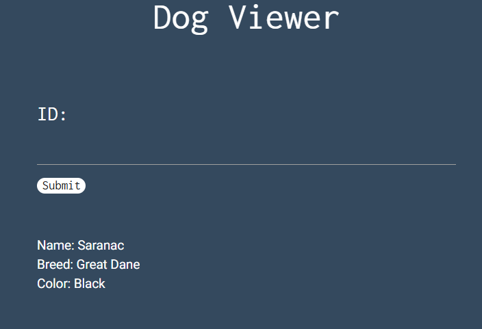
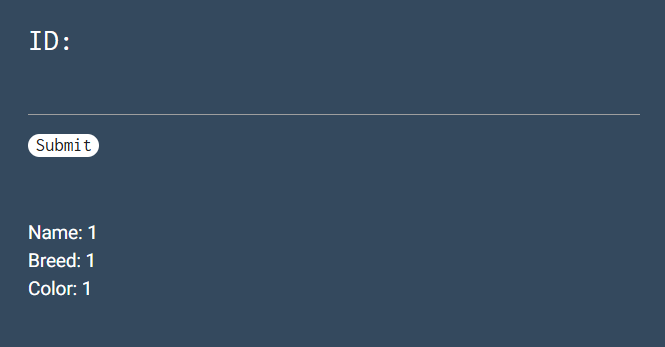
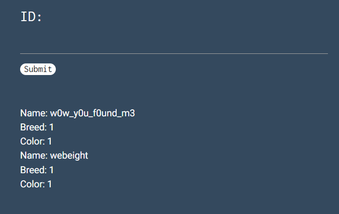
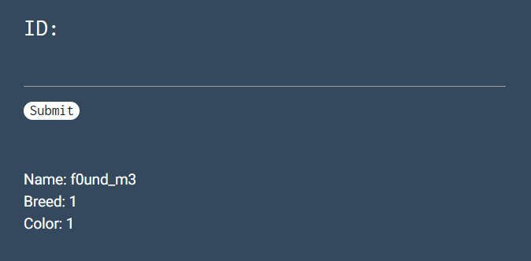
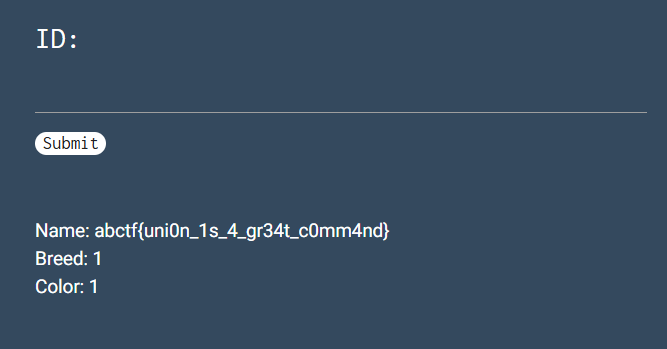

## Inj3ction Time  

We are given a webpage where we can search for dogs based on their ID in the database.  

The challenge names hints at SQLi, so we can test for that first. Since there are `4` columns (id, name, breed, color), we can craft a `UNION` attack payload that returns `4` columns, then try different comment syntax to determine the SQL variant the server is using.  

Sending `0 union select 1,1,1,1 #` succeeded, confirming that the server used MySQL for queries.  

The next thing we can do is to leak the database structure with `0 union select 1,table_name,1,1 from information_schema.tables where table_schema=DATABASE() #`, revealing the table `w0w_y0u_f0und_m3`.  

To get the columns, we can use `0 union select 1,column_name,1,1 from information_schema.columns where table_name like 0x77307725 #`. I think there's an SQLi filter that blacklists quotes, so we have to convert `w0w%` to hex and filter.  

Now, we can just read the column in the secret table with `0 union select 1,f0und_m3,1,1 from w0w_y0u_f0und_m3 #` to get the flag.  

Flag: `abctf{uni0n_1s_4_gr34t_c0mm4nd}`

