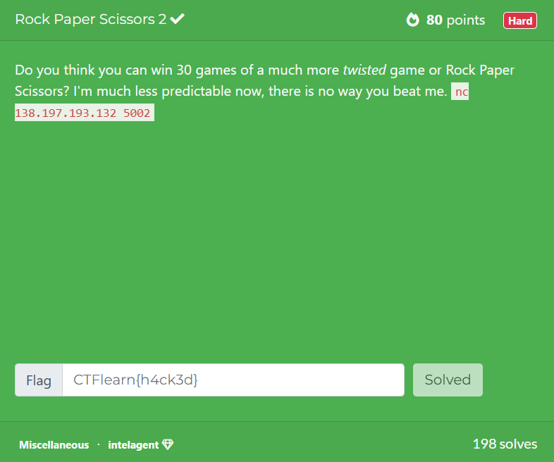
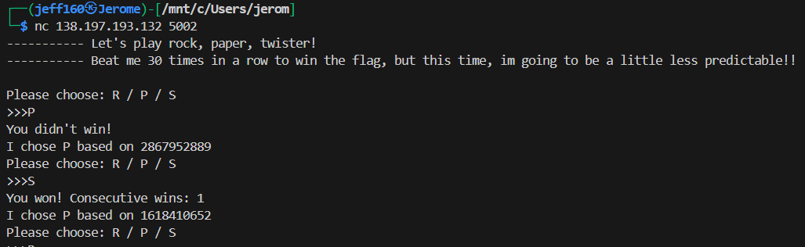
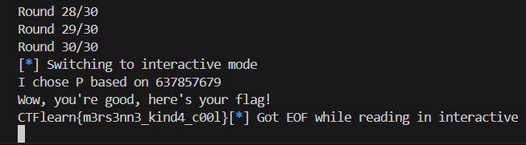

## Rock Paper Scissors 2  



We are given a service where we have to win `30` consecutive rounds of RPS to get the flag.  

Each time we play a move, the service will tell us whether we won or lost, and will also output the random number that it based its move upon.  



The challenge description hints at the Mersenne Twister, and Python uses MT19937 for PRNG.  

Based on observation, we can deduce that the moves are generated as shown below.  

```python
random.getrandbits(32) % 3  # 0: R, 1: P, 2: S
```

We can use [this module](https://github.com/tna0y/Python-random-module-cracker) to help us predict the next number the PRNG will generate server-side, then deduce the next move and choose the appropriate counter move to win.  

For the predictor to work, we need to supply it with the first `624` values generated by the PRNG, and we can automate this with Python.  

```python
leaked = []

for i in range(624):
    r.sendlineafter(b'>>>', b'R')

    r.recvline()

    rand = re.findall(r'based on (.+)', r.recvline().decode())[0].strip()
    leaked.append(int(rand))
```

After setting up the predictor, we can then win `30` consecutive rounds to get the flag.  



Flag: `CTFlearn{m3rs3nn3_kind4_c00l}`