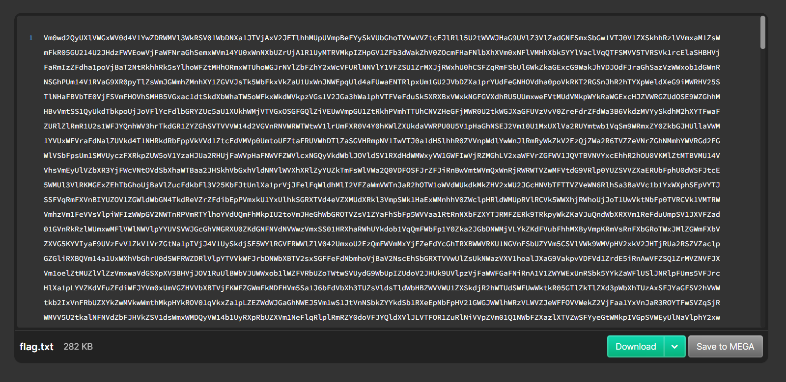

## So many 64s  

stupid chall lol  

We are provided with an extremely long Base64 string.  

The challenge name hints that we have to Base64-decode the ciphertext multiple times, so we can just keep doing that until we get the flag.  

Flag: `ABCTF{pr3tty_b4s1c_r1ght?}`