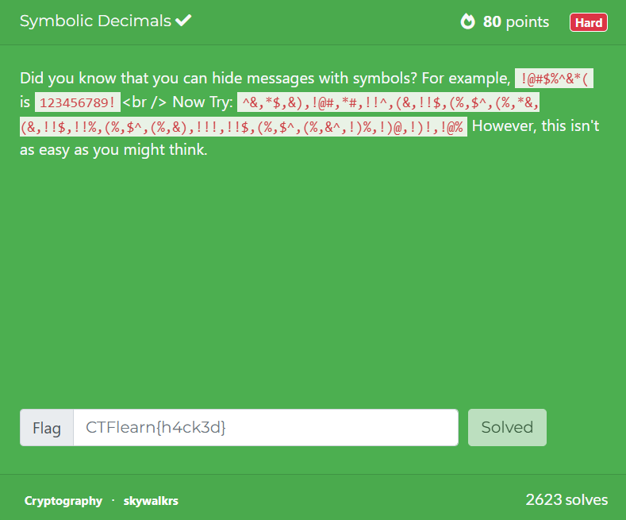

## Symbolic Decimals  



The challenge provides us with a ciphertext and a symbol mapping.  

Although `)` appears in the ciphertext but doesn't show up in the mapping, it would be logical to assume that it maps to `0`.  

We can first replace all the symbols in the ciphertext with their associated number, giving us a list of ascii values.  

```
67,84,70,123,83,116,97,114,95,46,95,87,97,114,115,95,46,95,70,111,114,95,46,95,76,105,102,101,125
```

We just have to convert all the ascii values to get the flag.  

Flag: `CTF{Star_._Wars_._For_._Life}`