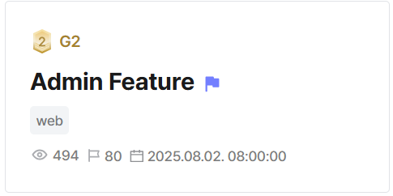

## Admin Feature  



command exec in `/admin/run`, requires api key  

`/admin/search` gives key oracle  

```kotlin
@Controller
@RequestMapping("/admin")
class AdminController(
    private val adminService: AdminService,
) {

    @PostMapping("/search")
    fun searchKey(@RequestBody data: ApiKeySearchDto, authUser: HttpSession): ResponseEntity<Map<String, Any>> {
        val response = mutableMapOf<String, Any>()
        try {

            val apiKey = adminService.doSearchKeyWithLimit(
                sessionUsername = authUser.getAttribute("username") as? String,
                password = data.password,
                apiKey = data.apiKey
            )

            response["result"] = 200
            response["message"] = apiKey.role
            return ResponseEntity.ok(response)


        } catch (e: AdminServiceException) {
            val statusCode = e.statusCode.value()
            response["result"] = statusCode
            response["message"] = e.message
            return ResponseEntity.status(statusCode).body(response)
        }
    }

    @PostMapping("/run")
    fun runCmd(@RequestParam cmd: String?, @RequestHeader("X-Api-Key") apiKey: String = "", authUser: HttpSession): ResponseEntity<Map<String, Any>> {
        val response = mutableMapOf<String, Any>()
        try {

            val result = adminService.testCommand(
                sessionUsername = authUser.getAttribute("username") as? String,
                cmd = cmd,
                apiKey = apiKey
            )

            response["result"] = 200
            response["message"] = result
            return ResponseEntity.ok(response)


        } catch (e: AdminServiceException){
            val statusCode = e.statusCode.value()
            response["result"] = statusCode
            response["message"] = e.message
            return ResponseEntity.status(statusCode).body(response)
        }
    }
}
```

spoof header to access `/admin` subendpoints  

```kotlin
@Configuration
@EnableWebSecurity
class SecurityConfig {

    val adminMatcher = RequestMatcher { request ->
        val uri = request.requestURI
        val ip = request.getHeader("X-Forwarded-For") ?: ""
        uri.startsWith("/admin") && ip == "127.0.0.1"
    }

    ...
```

rate limit of `5` requests for `/admin/search`  

bcrypt truncation cve --> cause mismatch between bcrypt and redis auth --> unlimited requests  

```kotlin
@Service
class AdminService(
    private val adminRepository: AdminRepository,
    private val userRepository: UserRepository,
    private val passwordEncoder: PasswordEncoder,
    private val redisTemplate: StringRedisTemplate
) {

    fun doSearchKeyWithLimit(
        sessionUsername: String?,
        password: String,
        apiKey: String
    ): ApiKey {
        if (sessionUsername == null) {
            throw AdminServiceException(HttpStatus.UNAUTHORIZED, "Login first.")
        }
        val user = userRepository.findByUsername(sessionUsername) ?: throw AdminServiceException(HttpStatus.NOT_FOUND, "username not exist.")

        if (!passwordEncoder.matches(password, user.password)) {
            throw AdminServiceException(HttpStatus.UNAUTHORIZED, "Password does not match.")
        }

        val redisKey = "searchLimit:$sessionUsername:${sha256(password)}"
        val count = redisTemplate.opsForValue().get(redisKey)?.toIntOrNull() ?: 0
        if (count == 0){
            redisTemplate.expire(redisKey, Duration.ofHours(1))
        }
        if (count >= 5){
            throw AdminServiceException(HttpStatus.TOO_MANY_REQUESTS, "Rate limit exceeded.")
        }
        redisTemplate.opsForValue().increment(redisKey)

        return searchKey(apiKey)


    }
```

Flag: `DH{d037669da71a51b3:ngpO/9g+GQLAPxsrI9ntfQ==}`