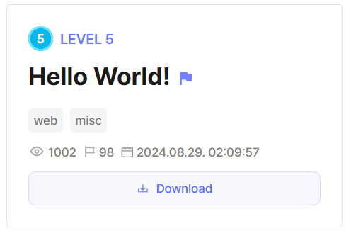
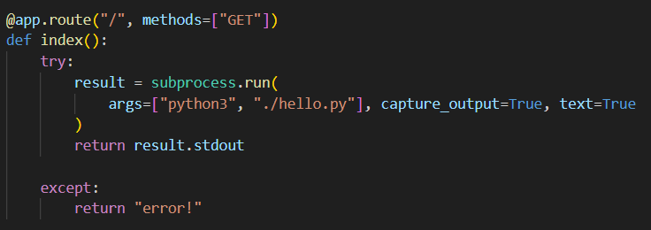
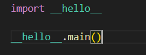
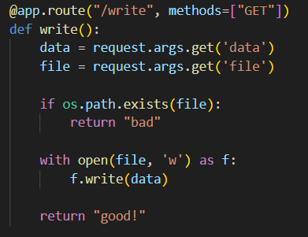
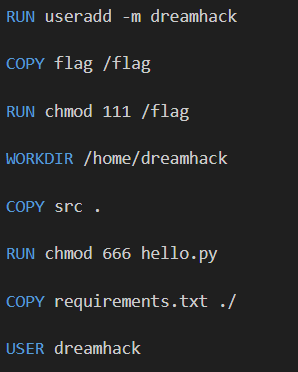
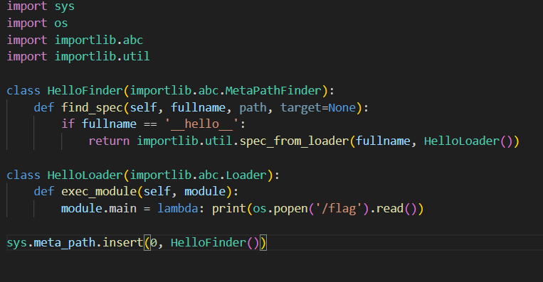
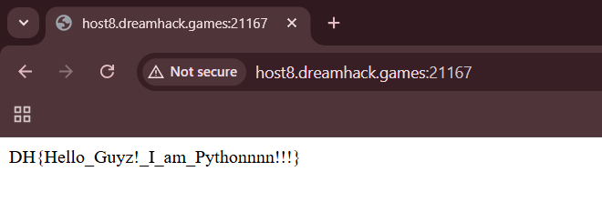

## Hello World!

We are given a webpage that executes `hello.py` on its root endpoint.    

All `hello.py` does is import the builtin `__hello__` module and call its `main()` function.  

We are also provided with a `/write` endpoint where we can write content to a new file. There is a check that prevents us from writing to existing files, so we can't simply overwrite `hello.py`.  

In Python, there is an optional file called `sitecustomize.py` which can be stored in the `/site-packages` directory, that will be run when the Python interpreter starts up.  

Since it doesn't exist by default, we can potentially write to it and get it to affect the behaviour of the `__hello__` module.  

Looking at the Dockerfile, we can deduce that `sitecustomize.py` will be stored at `/home/dreamhack/.local/lib/python3.10/site-packages/sitecustomize.py`. We also have to execute the `/flag` binary in the root directory to get the flag.  

We can write our own `sitecustomize.py` that will detect if `__hello__` is being imported, and if it does, it will overwrite it with a custom module that will execute the `/flag` binary instead.  

After URL-encoding our payload and submitting it to the `/write` endpoint, revisiting the root endpoint will give us the flag.  

