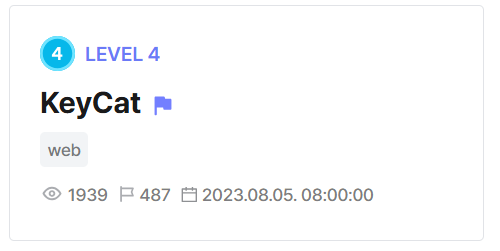

basically theres two flags in `/cat/flag` and `/cat/admin`  

server uses jwt for auth, but jwt signing has path traversal vuln since it doesnt validate file path in `kid`      

```js
const PATH_PREFIX = __dirname + '/keys'

const sign = async (filename) => {
    const KEY = fs.readFileSync(PATH_PREFIX + '/' + filename, 'utf-8');
    return jwt.sign({ filename: filename, username: 'dreamhack' }, KEY, { keyid: filename, algorithm: 'HS256' });
}

const verify = (token) => {
    let jwt_data = undefined
    let error = undefined

    jwt.verify(token, (header, cb) => { const data = fs.readFileSync(PATH_PREFIX + '/' + header.kid, 'utf-8'); console.log("Contents:", data); cb(null, data); }, { algorithm: 'HS256' }, (err, data) => {

        error = err;
        jwt_data = data;

    }
    )


    return { 'jwt_data': jwt_data, 'err': error };

}
```

`/cat/flag` requires the jwt token to be signed with the flag file  

```js
router.get('/flag', Auth, (req, res) => {
    console.log("Checking:", req.filename, FLAG_FILE_NAME)

    if (req.filename !== undefined && req.filename.indexOf(FLAG_FILE_NAME) !== -1) {

        return res.status(200).send(`🙀🙀🙀🙀🙀🙀 ${FLAG_CONTENT_1}`);
    }
    else {
        return res.status(401).render("error", { "img_path": '/img/error.png', "err_msg": "Unauthorized..." });
    }
})
```

`entrypoint.sh` adds a 2-char suffix to the flag file, so can just traverse to `../flag<xx>.txt` and bruteforce  

```sh
#!/bin/sh

export FLAG_CONTENT_1=$(cat /home/cat/deploy/flag.txt | cut -c 1-34)
export FLAG_CONTENT_2=$(cat /home/cat/deploy/flag.txt | cut -c 35-68)

FLAG=$(cat /dev/urandom | tr -dc 'a-f0-9' | fold -w 2 | head -n 1)

mv /home/cat/deploy/flag.txt /home/cat/deploy/flag$FLAG.txt

export FLAG_FILE_NAME=flag$FLAG.txt

exec "$@"
```

`/cat/admin` requires forged admin token  

jwt signing implementation allows token to be signed with any file, so can just sign the file with `../app.js`  

```js
router.get('/admin', Auth, (req, res) => {
    console.log("Checking username:", req.username)

    if (req.username !== undefined && req.username === 'cat_master') {
        return res.status(200).send(`Hello Cat Master😸 this is for you ${FLAG_CONTENT_2}`);
    }
    else {
        return res.status(403).send("Hello dreamhack! But I've got nothing you want");
    }
})
```

Flag: `DH{90b12bc264e96c4bec8ebef17cf4e45729242b7b14835a0255ee340d92b9c19d}`