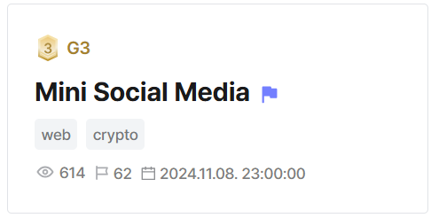

## Mini Social Media  

stored xss in /reports  

predict csp nonce using prng cracking  
    - python randcrack requires minimum 624 bits for prediction
    - each nonce uses 4 randint() calls --> 624/4 = 156  

Flag: `DH{e6e701c5:a6k6dtbdRS0VBLVA0HK+Jg==}`