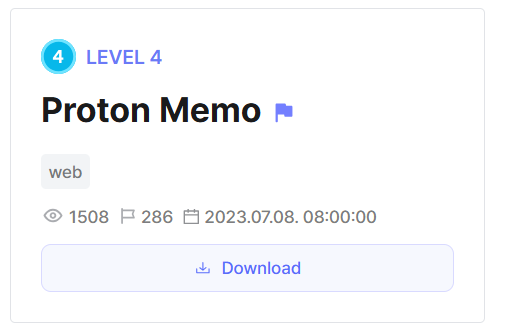
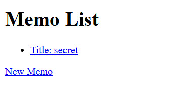
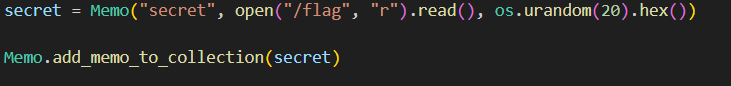
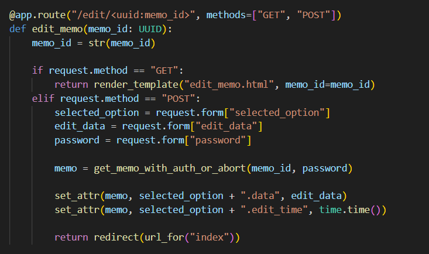
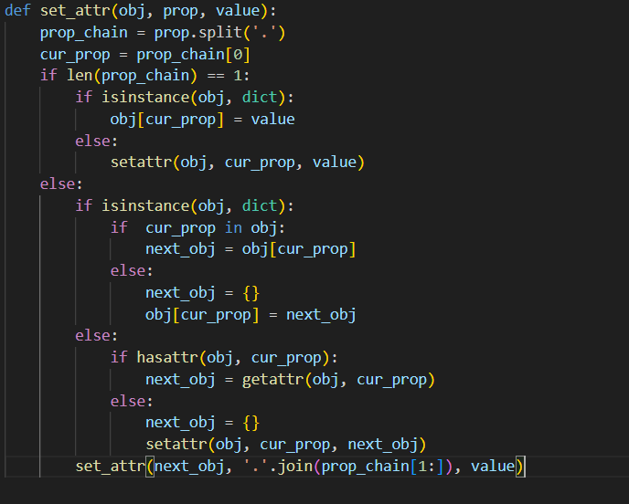
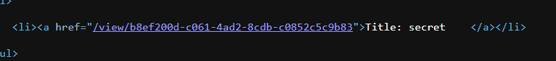
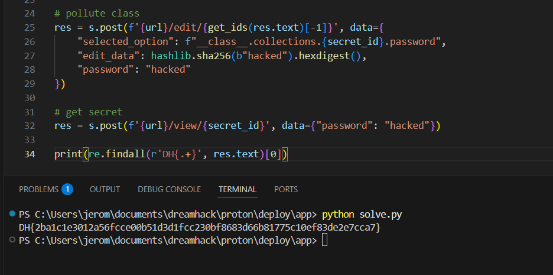

## Proton Memo



We are given a webpage that lists allows us to create and edit password-protected memos. 



There is a default memo that is added by default, which contains the flag. However, the password is strong and cannot be bruteforced.  



The `/edit` endpoint uses a function called `set_attr()` to dynamically update the attributes of the memo.  



Looking at the `set_attr()` function, there is a class pollution vulnerability, as it recursively traverses the provided property chain to modify the attribute. `.data` is appended at the back of the property chain so we are restricted to modifying implemented class instances.  



The `Memo` class itself contains a reference to the secret memo.  


To access the secret memo through `Memo.collections`, we can simply find the `id` in the home page.  



Since the `set_attr()` function handles dictionaries as well, we can modify the secret memo's password through a simple attribute chain.  

```python
memo.__class__.collections.{secret id}.password
```

The full attack would be to create a new memo, then edit it by setting `selected_option` to our payload and updating `secret`'s password to a known SHA256-encoded password, then open `secret` to view the flag.  

We can write a simple script to achieve this.  



Flag: `DH{2ba1c1e3012a56fcce00b51d3d1fcc230bf8683d66b81775c10ef83de2e7cca7}`