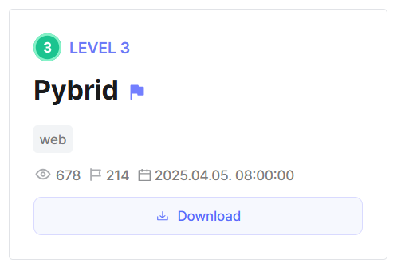
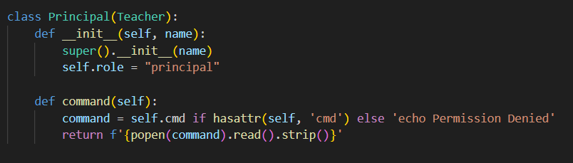
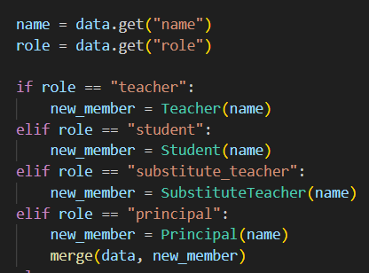
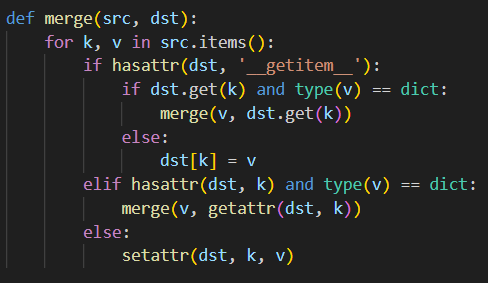

## Python FXXK



We are given a website where we can manage and add new school members to a server.  

The `Principal` class conveniently provides us with an RCE vector.  



The main vulnerability lies in the `/add_member` endpoint, where the POST data is merged with the new `Principal` object created. 



The `merge()` function updates the current member being added to the server, however, when it encounters a dictionary attribute, it will recursively visit and update it.  



In Python, we are able to access global attributes through an attribute chain.  

```python
new_member.__class__.__init__.__globals__
```

With this knowledge, we can craft a simple payload that will cause the server to inject our command into the global `Principal` object.  

```json
{
    "name": "hacker",
    "role": "principal",
    "__class__": { "__init__": { "__globals__": { "principal": { "cmd": "cat flag.txt" } } } }
}
```

Visiting the `/execute` endpoint after submitting our payload will then give us the flag.  


Flag: `DH{a8b5ad7d6e255825:UGzbTtI4PrSSGh/xrKyzoQ==}`
