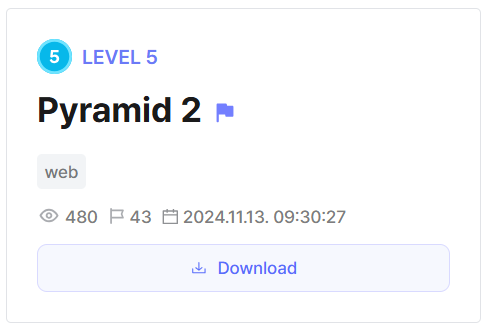
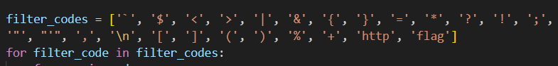
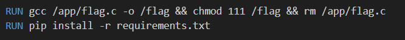
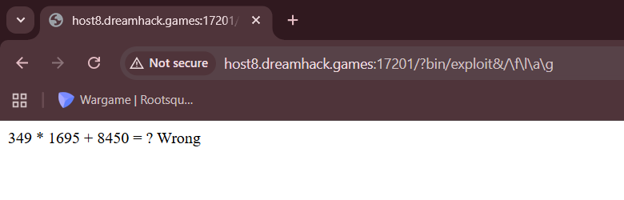
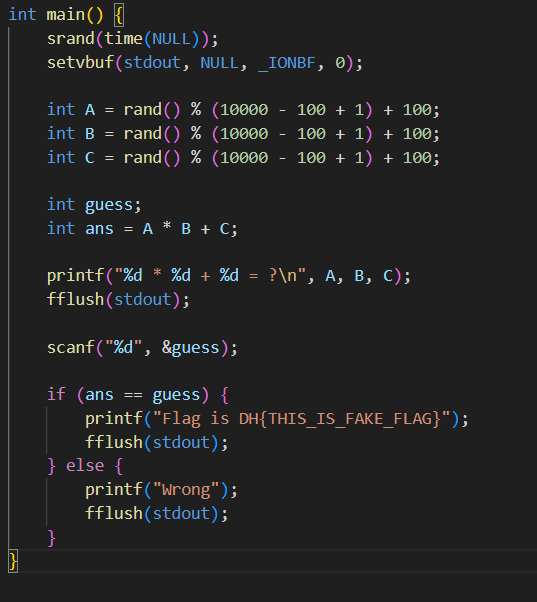
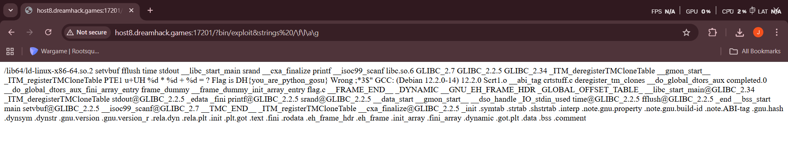

## Pyramid 2



The chall has a similar setup to [Pyramid](../Pyramid), except that the filter has been expanded, meaning we can't pip install with `git`.  



The Dockerfile also shows that the flag is stored as a binary to be executed in root.  



To bypass this, we can simply upload our exploit as a package on PyPi.  

```bash
python setup.py sdist bdist_wheel
twine upload dist/*
```

After uploading our exploit script on the server, we can use it to execute the binary. Since `"flag"` is blacklisted, we can bypass the filter using `/f\l\a\g`.  

However, this doesn't output the flag.  



Going back to the source code for the `flag` binary, we can see that the program actually prompts us to guess correctly the computation of 3 random integers for the flag to be outputted.  



Since we are interacting with the binary through the web interface, we have no way of directly submitting inputs to the binary.  

However, since the flag is stored as a constant in the binary, we can simply output the strings in the binary using `strings /f\l\a\g` and the flag will be inside.  


  

Flag: `DH{you_are_python_gosu}`


