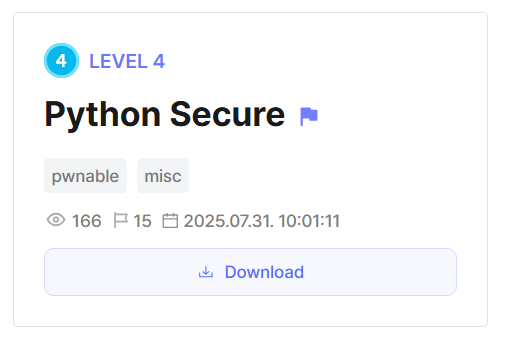
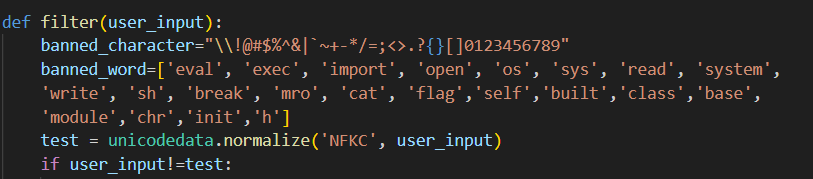
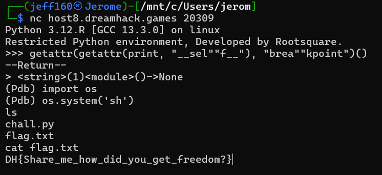

## Python Secure

Category: Pwnable, Misc    
Level: 4

We are given a restricted Python shell. The blacklist includes all digits and a lot of essential symbols. We are also restricted to 60 characters and under for each command.  

While the blacklist may look daunting at first, we notice that braces `()` and quotes aren't blacklisted, which is enough to bypass all the filters in place.  

We can first use a simple trick to access `__builtins__`, calling it through `print.__self__`, then invoke `breakpoint()`.  This gives us access to an unrestricted shell, where we can then retrieve the flag.

